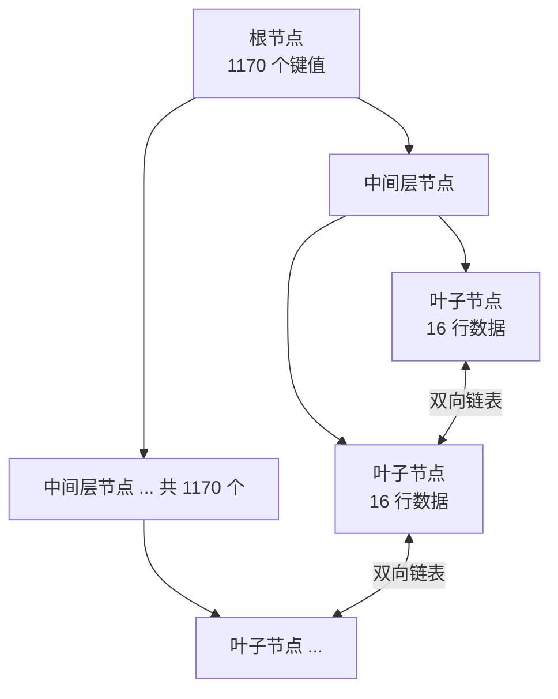

# 01. MySQL 为什么用 B+ 树做索引

> **记录时间**：2026-09-16 15:08
> **编号**：01
> **标签**：#索引 #B+树 #InnoDB #数据结构

---

## 一、问题

MySQL（InnoDB）的索引底层为什么选择 B+ 树，而不是哈希表、二叉搜索树或 B 树？

**面试场景**：后端开发岗一面/二面必考，通常紧跟在「什么是索引」之后。面试官真正的考点不是「B+ 树的结构」，而是**你是否理解「磁盘 IO 才是数据库的性能瓶颈」这个前提**——能答到这一层，才算和背题的人拉开差距。

---

## 二、答案

### 一句话结论

因为 B+ 树能用**最少的磁盘 IO 次数**（树高 3 层即可支撑千万级数据）换来**稳定的查询效率**，同时借助叶子节点双向链表天然支持范围查询与排序——这是哈希、二叉搜索树、B 树都无法同时满足的组合。

### 1. 是什么

InnoDB 的索引底层数据结构是 **B+ 树（B+Tree）**，一种多路平衡查找树，三个关键特征：

- **非叶子节点只存键值（key）和页号指针，不存数据行**，数据全部下沉到叶子节点。
- **所有叶子节点位于同一层**，因此任意一条记录的查询路径长度完全一致。
- **叶子节点之间用双向链表连接**，且键值在叶子层严格递增有序。

前两条决定了「树矮、IO 少、性能稳」，第三条决定了「范围查询快」。

### 2. 为什么（底层原理）

先立住前提：**数据库的性能瓶颈是磁盘 IO，不是 CPU 比较。**

内存访问约 100ns，而一次磁盘 IO，SSD 约 0.1ms，机械硬盘约 10ms——**相差 5 个数量级**。所以索引结构的设计目标只有一个：**把树高压到最低，让一次查询的 IO 次数尽可能少。**

InnoDB 读写磁盘的最小单位是**页（page）**，默认 16KB（`innodb_page_size`）。

#### 逐个否决其他结构

| 数据结构 | 等值查询 | 范围查询 | 1000 万数据的表现 | 结论 |
| ---- | ---- | ---- | ---- | ---- |
| 哈希表 | O(1) | **不支持** | 单点极快 | 无法排序、无法范围扫描，只能做辅助索引 |
| 二叉搜索树 / 红黑树 | O(log n) | 支持 | 树高至少 23 层 → 20+ 次 IO | 一次查询几十次磁盘 IO，不可接受 |
| B 树 | O(log n) | 支持但需跨层回溯 | 非叶节点存数据，扇出小，树更高 | 被 B+ 树取代 |
| **B+ 树** | O(log n) | **顺序扫描** | **3 层可存约 2190 万行** | ✅ 最优解 |

**为什么红黑树不行：** 1000 万条数据，log₂(10⁷) ≈ 23.3，即使树完全平衡也要 24 次比较；红黑树高度上界是 2×log₂(n+1)，实际通常在 25~35 层。每层一次磁盘 IO，意味着单次查询 20 次以上的随机 IO。

**为什么 B 树不行（关键对比点）：** B 树的非叶子节点同样存储数据行。这带来两个致命问题：

1. **扇出（fan-out）变小**：一页 16KB 如果被数据行占满，能容纳的键值数量骤降，树高随之上升。
2. **范围查询要中序遍历**：需要在不同层之间来回回溯，IO 次数不稳定。

B+ 树把数据全部下沉到叶子层，非叶子节点就只剩「键值 + 指针」，扇出被拉到最大。

#### 量化 B+ 树的优势

假设主键是 `bigint`（8 字节），InnoDB 的页号指针占 6 字节：

```text
单个键值对占用 = 8 + 6 = 14 字节
一页（16KB）可存放 = 16384 ÷ 14 ≈ 1170 个键值
```

假设一行数据约 1KB，则一个叶子页可存放约 16 行。



三层 B+ 树的容量：

```text
1170 × 1170 × 16 ≈ 21,900,000 行（约 2190 万）
```

也就是说，**一张 2000 万行的表，查一行最多 3 次磁盘 IO**。更关键的是：根节点和中间层节点会被 InnoDB 的 Buffer Pool 长期缓存在内存中，实际上通常只需要 **1~2 次真实磁盘 IO**。

这就是 B+ 树的核心价值：**用极低的树高，把查询的 IO 次数从上万次压缩到个位数**。

#### 三个附加收益

1. **查询性能稳定**：所有数据都在同一层，不存在某些记录快、某些记录慢的问题。
2. **范围查询高效**：定位到起始值后，沿着叶子节点链表顺序扫描即可，无需回溯到上层。`BETWEEN`、`ORDER BY`、`>、<` 都因此受益。
3. **更利于缓存**：非叶子节点不含数据，同样 16KB 能装下更多索引项，上层常驻内存的性价比更高。

### 3. 怎么用

```sql
-- 确认页大小（决定了扇出能力）
SHOW VARIABLES LIKE 'innodb_page_size';

-- 在 MySQL 8.0 中用 EXPLAIN ANALYZE 观察真实执行代价与扫描行数
EXPLAIN ANALYZE
SELECT * FROM users WHERE id = 1000000;

-- 估算表的规模，判断索引层数
SELECT table_name, table_rows, avg_row_length
FROM information_schema.tables
WHERE table_schema = 'your_database';

-- MySQL 8.0 查看索引的页层级（type 字段：3 = 叶子层）
SELECT t.name AS table_name, i.name AS index_name, i.type, i.PAGE_NO
FROM information_schema.INNODB_TABLES t
JOIN information_schema.INNODB_INDEXES i ON t.table_id = i.table_id
WHERE t.name = 'your_database/users';
```

### 4. 生产实践与坑

| 场景 | 建议 | 原因 |
| ---- | ---- | ---- |
| 主键使用随机 UUID（varchar(36)） | 改用自增 `bigint`，或有序 UUID（ULID / UUIDv7） | 随机插入会破坏 B+ 树的顺序性，引发大量**页分裂**和随机写入 |
| 主键使用长字符串 | 尽量缩短，或改用代理键 | 键值变长 → 单页可放键值数减少 → 扇出下降 → 树高上升 |
| 单表数据持续膨胀 | 关注 3 层容量上限（约 2000 万行量级） | 超过后树高增加，IO 次数上升，需要分库分表 |
| 频繁更新的列上建索引 | 谨慎评估 | 每次更新都要同步维护 B+ 树，页分裂与写放大成本高 |
| 认为「加了索引一定快」 | 结合 `EXPLAIN` 验证 | 优化器可能因预估行数过多而放弃走索引，导致全表扫描 |

**页分裂（page split）** 是这里最值得深挖的坑：当向一个已满的叶子页插入新记录时，InnoDB 会把该页拆成两页，并把一半数据挪过去。如果主键是自增的，新记录永远追加在最后一页，页分裂频率极低；如果是随机 UUID，插入位置随机，大量页会被反复拆分，结果是**页利用率下降（产生碎片）、随机 IO 增加、插入性能下降**。

### 5. 面试官可能追问

**追问 1：既然 B+ 树这么好，为什么还要有哈希索引？**

- 答法：哈希索引在**等值查询**上是 O(1)，快于 B+ 树的 O(log n)。MySQL 的 Memory 引擎支持显式哈希索引；InnoDB 则提供**自适应哈希索引（Adaptive Hash Index, AHI）**，会自动为频繁访问的索引页在内存中建立哈希表，属于运行时优化。但哈希索引不支持范围查询、不支持排序、不支持联合索引最左前缀匹配，所以只能作为 B+ 树的补充而非替代。

**追问 2：B+ 树和 B 树的扇出差距，能量化吗？**

- 答法：可以。B 树非叶子节点要存数据行，若单行 1KB，一页 16KB 只能放 16 个键值，扇出相比 B+ 树的 1170 缩小了约 70 倍；同样的数据量下树高会增加 2~3 层，意味着每次查询多出 2~3 次磁盘 IO。

**追问 3：Redis 的 ZSet 用跳表而不用 B+ 树，为什么？**

- 答法：因为 Redis 是**纯内存**结构，跳表的随机指针访问不产生磁盘 IO 成本；跳表实现更简单，插入删除无需复杂的再平衡（依靠概率维护层数），且并发场景下只需局部加锁。B+ 树的核心优势——低树高以减少磁盘 IO——在内存场景下并不构成决定性优势。

---

## 三、举一反三

> 状态：待回答

**问题**：如果一张用户表的主键从自增 `bigint` 换成了随机生成的 `varchar(36)` UUID，请从 **树高、页分裂、插入性能** 三个角度说明 B+ 树的物理表现会发生什么变化，并给出你的优化方案。

### 我的回答

（待填写）

### 评分与点评

（待评分）
