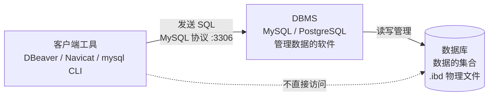
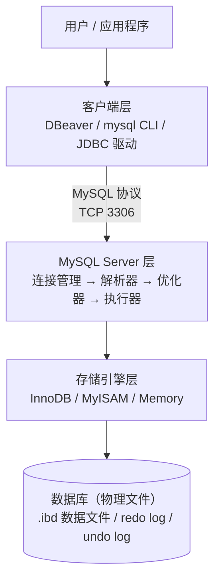

# 02. 数据库与数据库管理软件（DBMS）的区别 —— 以及 MySQL 和 DBeaver 是什么关系

> **记录时间**：2026-09-16 15:25
> **编号**：02
> **标签**：#基础概念 #DBMS #MySQL #DBeaver #体系结构

---

## 一、问题

1. 数据库（Database）和数据库管理软件（DBMS）的区别是什么？
2. MySQL 和 DBeaver 是什么关系？

**面试场景**：校招/初级岗一面高频，通常作为引入题。面试官真正的考点是**你脑子里的分层是否清晰**——能不能画出「应用 → 客户端 → DBMS → 存储介质」这条链路，并把每个产品放到正确的一层。很多人干了两年，仍然分不清 DBeaver 和 MySQL 谁依赖谁。

---

## 二、答案

### 一句话结论

**数据库是数据本身，DBMS 是管理数据的软件；MySQL 是 DBMS，DBeaver 是连接 MySQL 的图形化客户端工具**——DBeaver 不存任何业务数据，把它卸载掉，MySQL 里的数据一分不少。

### 1. 是什么

先把三个容易混的名词钉死：

| 名词 | 英文 | 是什么 | 例子 |
| ---- | ---- | ---- | ---- |
| **数据库** | Database | 按一定结构组织起来的**数据集合**，是数据的载体 | `shop` 库里的 users、orders 表及其全部记录 |
| **数据库管理系统** | DBMS | 介于用户与数据库之间、负责管理数据的**系统软件** | MySQL、PostgreSQL、Oracle、SQL Server、MongoDB |
| **数据库系统** | DBS | 数据库 + DBMS + 应用 + 人员的**整个体系**，指一套完整的运行环境 | 你们公司的整套订单数据存储方案 |

三者的包含关系：**DBS ⊃ DBMS ⊃ 数据库**。

日常说「MySQL 数据库」其实是简称，严格讲 MySQL 是 DBMS，它管理着若干个数据库。

然后是 **DBeaver**：一款开源的**通用数据库客户端工具（GUI Client）**。它和 Navicat、DataGrip、SQLyog、phpMyAdmin 是同一类东西。



一句话概括三者关系：**DBeaver 连 MySQL，MySQL 管数据库。**

### 2. 为什么（底层原理）

#### 为什么要分「数据」和「管理软件」两层

核心是**数据独立性**。如果没有 DBMS 这一层，应用程序就得自己处理：数据怎么落盘、怎么并发写、断电了怎么恢复、怎么控制权限——这些复杂能力全部交给 DBMS 统一提供，应用只需要说「我要查什么」。

DBMS 具体负责这些事：

- **定义**：DDL（`CREATE / ALTER / DROP`）
- **操作**：DML（`SELECT / INSERT / UPDATE / DELETE`）
- **存储与索引**：数据页、B+ 树、缓冲池
- **事务与并发**：ACID、隔离级别、MVCC、锁
- **恢复与安全**：redo / undo log、崩溃恢复、权限体系

#### MySQL 的分层架构，以及 DBeaver 站在哪一层



DBeaver 位于最上面的**客户端层**。它的工作只有三件事：

1. 通过 **JDBC 驱动**与 MySQL 建立 TCP 连接（默认端口 3306）
2. 把你的鼠标点击、表格编辑翻译成 **SQL 语句**发给 MySQL
3. 把 MySQL 返回的**结果集**渲染成表格

它**不参与**解析、优化、存储、事务——这些全在 MySQL 里。

#### 一个可以现场验证的事实

> 卸载 DBeaver，MySQL 里的数据一条不少，服务照常运行；
> 反过来，停掉 MySQL，DBeaver 立刻连不上。

因为数据从来就不在 DBeaver 里。DBeaver 只是遥控器，MySQL 才是那台机器。

#### 类比

| 概念 | 现实类比 |
| ---- | ---- |
| 数据库 | 仓库里的**货物** |
| DBMS（MySQL） | **仓库管理系统**：负责货架、出入库、盘点、安保 |
| DBeaver | 仓库的**操作台 / 遥控器**：只提供操作界面，不存货 |

### 3. 怎么用

在 DBeaver 的 SQL 编辑器里依次执行下面这些，把概念落到实体上：

```sql
-- 1. 创建一个「数据库」——这一步是让 DBMS 去建一个逻辑数据容器
CREATE DATABASE shop
  CHARACTER SET utf8mb4
  COLLATE utf8mb4_unicode_ci;

-- 2. 让 DBMS 列出它管理的所有数据库
SHOW DATABASES;

-- 3. 查看「数据库」在磁盘上的物理位置——数据库的真实形态就是一组文件
SHOW VARIABLES LIKE 'datadir';
-- 典型输出：/usr/local/mysql/data/

-- 4. 确认 DBMS 的版本
SELECT VERSION();
```

验证「DBeaver 只是客户端」：

```sql
-- 在 MySQL 侧执行，能看到 DBeaver 建立的那条连接
SHOW PROCESSLIST;
-- 关注 Host 列，会显示 DBeaver 来源的 IP 和端口

-- 在 DBeaver 里执行，确认自己是在哪条连接上
SELECT CONNECTION_ID(), USER(), DATABASE();
```

命令行下不用 DBeaver 也能完成同样的事：

```bash
# mysql 命令行客户端，和 DBeaver 处在同一层
mysql -h 127.0.0.1 -P 3306 -u root -p
```

```javascript
// Node.js / NestJS 里用驱动连接，同样和 DBeaver 处在同一层
import mysql from 'mysql2/promise';

const conn = await mysql.createConnection({
  host: '127.0.0.1',
  port: 3306,
  user: 'root',
  password: 'xxx',
  database: 'shop',
});

const [rows] = await conn.execute('SELECT * FROM users WHERE id = ?', [1]);
await conn.end();
```

### 4. 生产实践与坑

| 场景 | 建议 | 原因 |
| ---- | ---- | ---- |
| 在 DBeaver 里执行大批量 `UPDATE` / `DELETE` | 先 `SELECT` 确认影响范围，再开启事务执行 | DBeaver 默认 **autocommit**，点错就真改了，无法回滚 |
| 用 DBeaver 连生产库 | 使用只读账号，或开启 DBeaver 的 **Read-only connection** | 图形界面误操作是生产事故的高频来源 |
| 在 DBeaver 的表格里「直接改数据」 | 先确认目标表有主键 | DBeaver 会据此生成 `UPDATE`；**表无主键时，可能生成影响多行的 SQL** |
| 改了数据但同事看不到 | 检查自己的事务是否提交 | DBeaver 若关闭了自动提交，未 commit 的修改会一直持有行锁 |
| 多个客户端同时连同一个库 | 注意事务隔离级别与锁等待 | DBeaver 只是其中一个连接，不享有任何特殊地位 |
| 混淆 database 和 schema | 记住：**MySQL 中二者基本等价** | MySQL 里 `CREATE SCHEMA` 就是 `CREATE DATABASE` 的同义词 |

### 5. 面试官可能追问

**追问 1：那 MySQL 到底是数据库还是数据库管理系统？**

- 答法：严格说是 **DBMS**，而且是关系型 DBMS（RDBMS）。口语中的「MySQL 数据库」是简称，指的是「MySQL 这个 DBMS 管理的那些库」。面试官问这个通常是想确认你有没有概念洁癖——顺带提一句 RDBMS 走的是关系模型、用 SQL 作为接口，就能接住。

**追问 2：DBeaver 和 Navicat 有什么区别？**

- 答法：属于同一类——都是图形化数据库客户端。区别在三点：① DBeaver 社区版开源免费，Navicat 商业收费；② DBeaver 基于 Eclipse，通过 **JDBC** 通用驱动支持几乎所有数据库（MySQL、PG、Oracle、ClickHouse 等），扩展性更强；③ Navicat 在界面交互和部分数据同步功能上更顺手。二者都可以同时连多个不同的 DBMS，这恰好说明客户端和 DBMS 是解耦的。

**追问 3：不用 DBeaver 还能操作 MySQL 吗？**

- 答法：完全可以，而且更能说明问题。命令行 `mysql -u root -p` 可以，应用代码里的驱动也可以（Node.js 的 `mysql2`、Java 的 JDBC、Python 的 `PyMySQL`）。它们和 DBeaver **处于完全相同的客户端层**，走同样的 MySQL 协议。DBeaver 只是把这些能力包装成了图形界面。

**追问 4：数据库的「数据」到底存在哪个文件里？**

- 答法：InnoDB 引擎下，MySQL 8.0 的表结构与数据都存放在**独立表空间文件 `.ibd`** 中，位于 `datadir` 目录下对应库名的子目录里；此外还有 redo log（`ib_logfile*`）、undo log 等保证事务与崩溃恢复。这就是「数据库」的物理形态——**它本质就是一组文件，是 DBMS 赋予了这些文件结构化的意义**。

---

## 三、举一反三

> 状态：待回答

**问题**：DBeaver 可以同时连接 MySQL、PostgreSQL、ClickHouse 这三种完全不同的 DBMS，而你的 NestJS 应用代码里换一个数据库往往要改不少东西。请从**客户端与 DBMS 解耦**的角度解释：为什么 DBeaver 能做到「一套界面连所有库」？它依赖的关键机制是什么？这个机制在你的应用代码里对应的是什么？

### 我的回答

（待填写）

### 评分与点评

（待评分）
