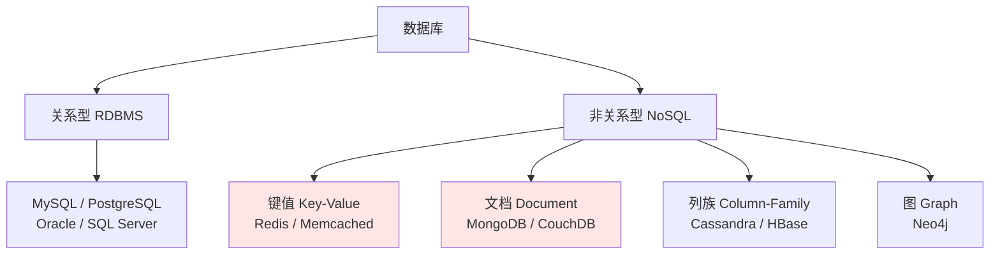
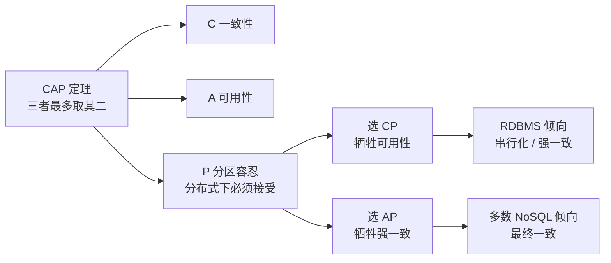

# 03. 关系型数据库与非关系型数据库的区别 —— 以及 MongoDB 和 Redis 分别属于哪一类

> **记录时间**：2026-09-16 15:39
> **编号**：03
> **标签**：#选型 #NoSQL #RDBMS #MongoDB #Redis

---

## 一、问题

1. 关系型数据库（RDBMS）和非关系型数据库（NoSQL）的区别是什么？各自有哪些优缺点？
2. 文档型数据库，比如 MongoDB 和 Redis，属于哪个类型？

**面试场景**：后端岗必考，通常出现在「你们项目为什么这么选型」或「什么场景下不用 MySQL」这类追问里。面试官真正的考点是**你是否理解「没有银弹」**——能说清每类数据库的取舍边界，而不是背一张对比表。

> ⚠️ **先纠正一处概念**：你的问题把 MongoDB 和 Redis 归为了同一类。**MongoDB 是文档型数据库，Redis 是键值型数据库**，两者虽同属 NoSQL，但不是同一种类型。文档内会详述。

---

## 二、答案

### 一句话结论

关系型数据库用**二维表 + 强 Schema + SQL + ACID 事务**换取一致性和复杂查询能力；非关系型数据库通过**弱化或放弃**这些约束，换取 schema 灵活性、水平扩展能力和极致性能。**MongoDB 是文档型（Document），Redis 是键值型（Key-Value）**，二者属于 NoSQL 下的不同分支。

### 1. 是什么

#### 关系型数据库（RDBMS）

基于 E.F. Codd 在 1970 年提出的**关系模型**，四个核心特征：

- **二维表结构**：行（记录）+ 列（字段）
- **强 Schema（Schema-on-Write）**：写入前必须先 `CREATE TABLE` 定义结构，写时就校验
- **SQL 作为统一查询语言**：声明式，只需描述「要什么」
- **ACID 事务 + 表间约束**：主键、外键、唯一索引、级联
- 代表：**MySQL**、PostgreSQL、Oracle、SQL Server

#### 非关系型数据库（NoSQL）

**NoSQL 不是一个单一技术，而是四类不同数据模型的统称**。这张表的分类关系，正是你第二个问题的答案：



| 类型 | 数据模型 | 代表 | 典型场景 |
| ---- | ---- | ---- | ---- |
| **键值 KV** | `key → value` | **Redis**、Memcached | 缓存、Session、分布式锁、计数器、排行榜 |
| **文档 Document** | JSON / BSON 文档 | **MongoDB**、CouchDB | 结构多变的业务对象、内容管理、日志 |
| **列族 Column-Family** | 按列族存储 | Cassandra、HBase | 海量写入、时序数据、宽表分析 |
| **图 Graph** | 节点 + 边 | Neo4j | 社交关系、风控反欺诈、推荐图谱 |

所以明确结论：

- **MongoDB → 文档型（Document）NoSQL**
- **Redis → 键值型（Key-Value）NoSQL**

Redis 容易让人误以为是文档型，是因为它的 value 支持 String / Hash / List / Set / ZSet 等多种结构，官方自称 **"data structures server"（数据结构服务器）**。但本质上**只能通过 key 访问**，没有类 SQL 的查询语言，也没有二级索引——这是 KV 的本质特征。

### 2. 为什么（底层原理）

#### 先看 RDBMS 的强项从哪来

- **规范化设计**：范式（1NF/2NF/3NF）消除数据冗余
- **ACID 事务**：原子性、一致性、隔离性、持久性
- **MVCC + 锁**：读写不互相阻塞，支撑高并发
- **WAL（redo log）**：先写日志再刷盘，保证崩溃后数据不丢
- **查询优化器**：你写 `SELECT ... WHERE ...`，优化器决定走哪个索引、用什么 JOIN 顺序

#### NoSQL 为何会出现（技术动因）

不是因为「SQL 不好」，而是四类互联网场景超出了单机关系库的舒适区：

1. **数据量与写入量**：TB / PB 级数据、百万级 QPS 写入，单机撑不住
2. **Schema 变更成本高**：业务快速迭代时，大表上 `ALTER TABLE` 可能锁表数小时
3. **结构天然不规整**：社交动态、商品属性、埋点日志，字段嵌套且各条记录不一致
4. **水平扩展需求**：NoSQL **原生支持分片（sharding）**，而 MySQL 的分库分表要靠中间件或应用层自己实现

#### 核心取舍：CAP 与 ACID vs BASE



| 维度 | RDBMS | 多数 NoSQL |
| ---- | ---- | ---- |
| 事务模型 | **ACID**（强一致） | **BASE**（基本可用、软状态、最终一致） |
| 一致性 | 强一致 | 多为最终一致（MongoDB 可配 majority 读关注） |
| 扩展方式 | **Scale-up**：换更强的机器 | **Scale-out**：加机器 + 原生分片 |
| Schema | Schema-on-Write（写时校验） | **Schema-on-Read**（读时解析） |

> **BASE 理论**是大厂面试的高频考点：Basically Available（基本可用）、Soft state（软状态）、Eventually consistent（最终一致）。它是 ACID 在分布式 CAP 约束下的退让产物。

### 3. 怎么用

同一个「用户信息」在三类数据库中的形态差异，最能说明问题。

```sql
-- MySQL：必须先定义结构，结构统一
CREATE TABLE users (
  id         BIGINT PRIMARY KEY AUTO_INCREMENT,
  name       VARCHAR(50) NOT NULL,
  age        INT,
  city       VARCHAR(50),
  tags       JSON,                          -- MySQL 5.7+ 支持 JSON 类型
  created_at DATETIME DEFAULT CURRENT_TIMESTAMP
) ENGINE=InnoDB;

INSERT INTO users (name, age, city) VALUES ('张三', 28, '北京');
SELECT * FROM users WHERE age > 25 ORDER BY created_at DESC LIMIT 10;
```

```javascript
// MongoDB：文档形态，同一集合内文档结构可以各不相同
db.users.insertOne({
  name: "张三",
  age: 28,
  address: { city: "北京", street: "朝阳区" },   // 天然支持嵌套
  tags: ["vip", "new"],
  createdAt: new Date()
});

db.users.createIndex({ age: -1 });
db.users.find({ age: { $gt: 25 } }).sort({ age: -1 }).limit(10);
```

```bash
# Redis：键值形态 —— 注意这里不能对 age 做 WHERE 查询
SET user:1 '{"name":"张三","age":28}' EX 3600
GET user:1

# 用 Hash 结构存部分字段
HSET user:1 name 张三 age 28
HGETALL user:1

# 排行榜：ZSet（这正是 Redis 无法被 MySQL 替代的场景）
ZADD leaderboard 1200 user:1
ZREVRANGE leaderboard 0 9 WITHSCORES
```

**最能点破本质的对比**：Redis 里你**没法**写 `WHERE age > 25`——它没有查询语言，只能通过 `user:1` 这个 key 去取。这决定了它只能做「按 key 快速存取」，而 MySQL / MongoDB 能做任意条件检索。

### 4. 生产实践与坑

| 场景 | 选型建议 | 原因 |
| ---- | ---- | ---- |
| 订单、支付、账务 | **必须用 RDBMS**（MySQL / PG） | 需要多行强一致事务，金融场景不能容忍最终一致 |
| 商品详情、文章内容、CMS | MongoDB | 结构嵌套、字段多变，避免频繁 `ALTER TABLE` |
| 缓存、Session、计数器、限流 | Redis | 内存读写微秒级，MySQL 的 QPS 差着数量级 |
| 排行榜、延时队列、分布式锁 | Redis（ZSet / Redlock） | ZSet 原生有序，MySQL 做实时排名要 `ORDER BY` 全表 |
| 好友关系、N 度人脉、风控图谱 | Neo4j 图数据库 | MySQL 递归查询性能随层级指数级劣化 |
| 监控指标、海量日志 | Cassandra / ClickHouse | 高吞吐写入 + 时序聚合 |
| **想用 MongoDB 存账务流水** | ❌ 不要 | 虽有事务支持，但一致性保障与生态远不如 MySQL |
| **想用 Redis 当主存储** | ❌ 极度谨慎 | RDB/AOF 持久化都有数据丢失窗口，重启可能丢秒级数据 |
| 微服务混合使用 | 混合持久化（Polyglot Persistence） | 一个系统里多种存储并存，各自负责擅长的事 |

**NestJS 技术栈里的典型分工**：

```text
MySQL   → 主业务数据，TypeORM / Prisma 建实体模型
Redis   → 缓存层 + 分布式锁 + BullMQ 任务队列的底层存储
MongoDB → 日志 / 动态 schema 的非核心业务
```

**经典坑：MySQL + Redis 缓存一致性**。二者双写时，正确姿势是 **Cache-Aside 模式**——**先更新数据库，再删除缓存**（而不是更新缓存）。若反过来先删缓存再更新库，在并发读写下极易把脏数据回填到缓存里。

### 5. 面试官可能追问

**追问 1：Redis 是文档型数据库吗？**

- 答法：**不是，Redis 是键值型（Key-Value）**。它容易被误判是因为 value 支持 String / Hash / List / Set / ZSet 五种结构，官方文档称其为 "data structures server"。区分标准很简单：**能否绕开 key 做条件检索**。MongoDB 可以 `db.users.find({age: {$gt: 25}})`，Redis 只能 `GET key`——没有查询语言、没有二级索引，这就是 KV 的本质。

**追问 2：NoSQL 是不是就不需要 Schema 了？**

- 答法：**这是最常见的误解**。准确说法是 NoSQL 采用 **Schema-on-Read（读时解析）**，而非 RDBMS 的 **Schema-on-Write（写时校验）**。数据依然有结构，只是这个结构**不被数据库强制约束**，转而由应用代码维护。代价是把校验责任从 DB 推给了应用层——如果多个服务写入同一个集合且没有统一约束，后期数据治理会非常痛苦，常常出现「同一个字段有的文档是 string、有的是 int」。

**追问 3：MongoDB 能替代 MySQL 吗？**

- 答法：不能简单替代，二者定位不同。MongoDB 从 4.0 起支持多文档 ACID 事务（副本集），4.2 起支持分片集群事务，但**事务开销显著高于 MySQL**，不适合高频短事务。MySQL 的强项是多行事务、复杂 JOIN、外键约束与成熟的一致性保障；MongoDB 的强项是灵活的文档模型与原生水平扩展。真实系统里二者常常共存而非互斥。

**追问 4：MySQL 5.7+ 已经支持 JSON 类型了，是不是能替代 MongoDB？**

- 答法：不能完全替代。MySQL 5.7 起提供原生 `JSON` 类型，支持 `->>` 操作符提取字段、并能对 JSON 中的值建二级索引（通过生成列）。但相比 MongoDB 仍有三个缺口：缺少原生的文档查询语言、嵌套结构上的索引能力有限、没有自动分片。**适合「少量动态字段」的补丁式需求**（例如给订单表加几个扩展属性），不适合把整个业务模型文档化。

---

## 三、举一反三

> 状态：待回答

**问题**：假设你要设计一个**电商秒杀系统**，库存数据既要支撑**每秒数十万次查询**，又要保证**绝对不能超卖**。

已知单独的 MySQL 扛不住这个读 QPS，单独的 Redis 又存在数据丢失与一致性风险。请你给出组合方案，并说明：

1. 库存的**权威数据**应该放在 MySQL 还是 Redis？为什么？
2. 读请求如何扛住高并发？
3. 扣减库存时如何保证不超卖？靠 Redis 的原子操作还是 MySQL 的行锁？两者的代价分别是什么？
4. 如果 Redis 在扣减完成后宕机，会发生什么？如何兜底？

### 我的回答

（待填写）

### 评分与点评

（待评分）
