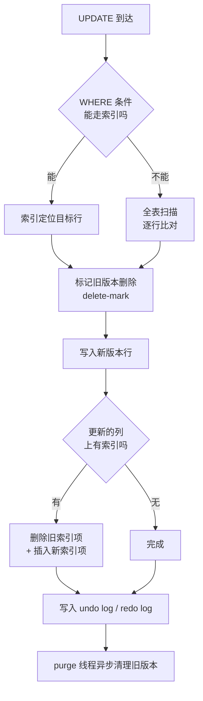

# 04. 最标准的 CRUD 语句怎么写

> **记录时间**：2026-09-16 16:23
> **编号**：04
> **标签**：#CRUD #SQL语法 #DML #DDL #生产规范

---

## 一、问题

最标准的对「库」的 CRUD 语句怎么写？

**面试场景**：一面基础题，通常以「手写一条 SQL」的形式出现。面试官**不是**在看你语法记得牢不牢——语法查手册就会。真正的考点是：**你有没有生产意识**（WHERE 保护、事务包裹、批量优化），以及能不能说清 `DELETE` / `TRUNCATE` / `DROP` 的区别。

> 💡 **先拆一下歧义**：「对库的 CRUD」里的「库」可以指三个层次，面试官问的时候也可能混着问，所以文档按三层全覆盖：
> - **库级**（database）：对整个数据库的增删改查
> - **表级**（table）：对表结构的增删改查
> - **数据级**（row）：对数据行的增删改查 ← **这才是 CRUD 的本义，也是重点**

---

## 二、答案

### 一句话结论

MySQL 的 CRUD 分三层：库和表用 **DDL**（`CREATE` / `ALTER` / `DROP`），数据行用 **DML**（`INSERT` / `UPDATE` / `DELETE`）+ **DQL**（`SELECT`）。而**「标准」的关键不在语法，在于三件事：建库建表必须显式指定 `utf8mb4`、改删必须带 `WHERE`、批量操作必须考虑事务与锁**。

### 1. 是什么

#### SQL 语句的四大分类

| 类别 | 全称 | 作用 | 代表语句 |
| ---- | ---- | ---- | ---- |
| **DDL** | Data Definition Language | 定义结构 | `CREATE`、`ALTER`、`DROP`、`TRUNCATE` |
| **DML** | Data Manipulation Language | 操作数据 | `INSERT`、`UPDATE`、`DELETE` |
| **DQL** | Data Query Language | 查询数据 | `SELECT` |
| **DCL** | Data Control Language | 权限控制 | `GRANT`、`REVOKE` |

#### CRUD 与 SQL 的对应关系

| CRUD | SQL 语句 | 所属类别 | 作用对象 |
| ---- | ---- | ---- | ---- |
| **C**reate | `INSERT` | DML | 数据行 |
| **R**ead | `SELECT` | DQL | 数据行 |
| **U**pdate | `UPDATE` | DML | 数据行 |
| **D**elete | `DELETE` | DML | 数据行 |

**注意一个容易踩的坑**：`INSERT` / `UPDATE` / `DELETE` 属于 DML，**可以回滚**；而 `CREATE` / `ALTER` / `DROP` / `TRUNCATE` 属于 DDL，会**隐式提交（implicit commit）**，**不可回滚**。这个区别在生产环境里是致命的。

### 2. 为什么（底层原理）

#### 为什么 `DELETE` 慢而 `TRUNCATE` 快

- **`DELETE`**：逐行标记删除，每删一行都要写 **undo log**（用于回滚）和 **redo log**（用于崩溃恢复），还要维护所有二级索引，并触发触发器。删 100 万行就是 100 万次这样的操作。
- **`TRUNCATE`**：本质是 **DDL**，InnoDB 的做法是直接**丢弃并重建表空间**，不逐行处理、不写 undo log、不触发触发器，所以快得不是一个量级。

#### 为什么更新索引列代价高

InnoDB 中一次 `UPDATE` 的物理动作是：



> **特别提醒**：如果更新的正是**主键**，代价最高——等价于「删除整行 + 插入新行」，还可能触发**页分裂**。生产上应视主键为不可变字段。

#### `SELECT` 的执行顺序

这是理解 SQL 的关键，**书写顺序和执行顺序完全不同**：


这解释了面试常问的一个细节：**为什么 `WHERE` 里不能用 `SELECT` 里定义的别名，而 `ORDER BY` 里可以？** 因为 `WHERE` 在 `SELECT` 之前执行，此时别名还不存在；`ORDER BY` 在 `SELECT` 之后，所以能用。

### 3. 怎么用

#### （1）库级 CRUD

```sql
-- ========== CREATE ==========
-- 标准写法：永远显式指定字符集和排序规则
CREATE DATABASE IF NOT EXISTS shop
  DEFAULT CHARACTER SET utf8mb4
  DEFAULT COLLATE utf8mb4_0900_ai_ci;   -- MySQL 8.0 默认；5.7 用 utf8mb4_general_ci

-- ========== READ ==========
SHOW DATABASES;
SHOW CREATE DATABASE shop;

SELECT SCHEMA_NAME, DEFAULT_CHARACTER_SET_NAME, DEFAULT_COLLATION_NAME
FROM information_schema.SCHEMATA
WHERE SCHEMA_NAME = 'shop';

-- ========== UPDATE ==========
ALTER DATABASE shop
  CHARACTER SET utf8mb4
  COLLATE utf8mb4_0900_ai_ci;
-- ⚠️ 注意：改库的字符集【不会】改变已有表的字符集，需要单独 ALTER TABLE

-- ========== DELETE ==========
DROP DATABASE IF EXISTS shop;   -- ⚠️ 不可回滚，库内的所有表和数据一起消失
```

#### （2）表级 CRUD

```sql
-- ========== CREATE ==========
CREATE TABLE IF NOT EXISTS users (
  id         BIGINT UNSIGNED NOT NULL AUTO_INCREMENT COMMENT '主键',
  name       VARCHAR(50)     NOT NULL                COMMENT '用户名',
  age        TINYINT UNSIGNED         DEFAULT NULL    COMMENT '年龄',
  status     TINYINT         NOT NULL DEFAULT 1      COMMENT '状态：1正常 0禁用',
  created_at DATETIME        NOT NULL DEFAULT CURRENT_TIMESTAMP COMMENT '创建时间',
  updated_at DATETIME        NOT NULL DEFAULT CURRENT_TIMESTAMP
                                      ON UPDATE CURRENT_TIMESTAMP COMMENT '更新时间',
  PRIMARY KEY (id),
  KEY idx_name (name)
) ENGINE=InnoDB
  DEFAULT CHARSET=utf8mb4
  COLLATE=utf8mb4_0900_ai_ci
  COMMENT='用户表';

-- ========== READ ==========
DESC users;
SHOW CREATE TABLE users;
SHOW INDEX FROM users;

-- ========== UPDATE ==========
ALTER TABLE users ADD COLUMN phone VARCHAR(20) DEFAULT NULL AFTER name;
ALTER TABLE users MODIFY COLUMN name VARCHAR(100) NOT NULL COMMENT '用户名';
ALTER TABLE users CHANGE COLUMN phone mobile VARCHAR(20) DEFAULT NULL;  -- 改名+改类型
ALTER TABLE users ADD INDEX idx_age (age);
ALTER TABLE users DROP COLUMN mobile;
ALTER TABLE users RENAME TO members;

-- ========== DELETE ==========
DROP TABLE IF EXISTS users;      -- 表结构和数据一起删除
TRUNCATE TABLE users;            -- 只清数据，保留结构，自增重置为 1
```

> **`ALTER TABLE` 的生产警告**：MySQL 5.6 之前，添加列、修改列类型等操作会**锁表并重建整表**；5.6+ 支持 Online DDL 后只锁短时间元数据，但**修改列类型、变更字符集**等仍会重建表。大表（千万级以上）上线前必须用 `gh-ost` 或 `pt-online-schema-change`。

#### （3）数据级 CRUD（核心）

```sql
-- ========== CREATE ==========

-- 单行插入
INSERT INTO users (name, age) VALUES ('张三', 28);

-- 多行批量插入 ✅ 推荐：一次网络往返、一次事务，性能远优于循环单条插入
INSERT INTO users (name, age) VALUES
  ('李四', 30),
  ('王五', 25),
  ('赵六', 35);

-- INSERT ... SELECT：从其他表灌数据（注意：会加共享锁）
INSERT INTO users_bak (name, age)
SELECT name, age FROM users WHERE status = 1;

-- 主键/唯一键冲突时改为更新（常被用作「幂等写入」）
INSERT INTO users (id, name, age) VALUES (1, '张三', 29)
ON DUPLICATE KEY UPDATE
  name = VALUES(name), age = VALUES(age);

-- MySQL 8.0.20+ 官方推荐的新写法（VALUES() 已废弃）
-- INSERT INTO users (id, name, age) VALUES (1, '张三', 29) AS new
-- ON DUPLICATE KEY UPDATE name = new.name, age = new.age;

-- ========== READ ==========
SELECT id, name, age
FROM users
WHERE age > 25 AND status = 1
ORDER BY id DESC
LIMIT 10;

SELECT COUNT(*) AS total FROM users WHERE status = 1;

-- ========== UPDATE ==========
UPDATE users
SET age = 29, status = 1
WHERE id = 1;                       -- ⚠️ WHERE 是命根子，没有它全表更新

-- 多表关联更新
UPDATE users u
JOIN user_profiles p ON u.id = p.user_id
SET u.status = 0
WHERE p.expire_at < NOW();

-- ========== DELETE ==========
DELETE FROM users WHERE id = 1;

-- 分批删除（生产标准写法，避免大事务）
DELETE FROM users
WHERE status = 0 AND created_at < '2023-01-01'
ORDER BY id
LIMIT 1000;                          -- 循环执行直到 affected rows = 0
```

### 4. 生产实践与坑

#### `DELETE` / `TRUNCATE` / `DROP` 三兄弟对比（高频考点）

| 维度 | `DELETE` | `TRUNCATE` | `DROP` |
| ---- | ---- | ---- | ---- |
| **语句类别** | DML | **DDL** | **DDL** |
| **能否带 `WHERE`** | ✅ 可以 | ❌ 不行 | ❌ 不行 |
| **删除范围** | 满足条件的行 | 全部行 | **表结构 + 数据** |
| **能否回滚** | ✅ 事务内可回滚 | ❌ 隐式提交，不可回滚 | ❌ 不可回滚 |
| **自增计数器** | 保留（不重置） | **重置为 1** | 随表一起删除 |
| **执行速度** | 慢（逐行写日志） | 快（重建表空间） | 快 |
| **是否触发触发器** | ✅ 触发 | ❌ 不触发 | ❌ 不触发 |
| **磁盘空间** | 不立即回收 | 立即回收 | 立即回收 |
| **典型用途** | 按条件删数据 | 清空整表（测试环境） | 废弃整表 |

#### 生产规范清单

| 场景 | 规范 | 原因 |
| ---- | ---- | ---- |
| `UPDATE` / `DELETE` 不带 `WHERE` | **严禁** | 线上事故第一杀手。执行前先 `SELECT` 确认影响行数 |
| 大批量删除 | 分批 + `LIMIT` + 循环 | 大事务会长时间持锁、撑爆 undo log、导致主从延迟 |
| 需要回滚的删除 | 只能用 `DELETE` | `TRUNCATE` 是 DDL，隐式提交，回滚不了 |
| 批量插入 | 单条 SQL 多 `VALUES` | 减少网络往返与事务开销 |
| 表结构变更 | 大表用 `gh-ost` / `pt-osc` | 部分 `ALTER` 会重建整表并长时间锁表 |
| 主键更新 | 视为不可变，尽量避免 | InnoDB 中更新主键 = 删除 + 插入，代价极高 |
| 业务删除 | 优先**软删除**（`is_deleted` / `deleted_at`） | 保留可追溯性；但代价是所有查询都要带过滤条件 |
| 执行危险 SQL 前 | 手动开启事务，确认后再 `COMMIT` | 给一次「后悔」的机会 |

**软删除的隐性代价**（面试加分点）：软删除会让表持续膨胀、索引选择性下降（大量 `is_deleted = 1` 的行仍占索引），且**所有业务查询都必须记得带上过滤条件**——一旦有一条 SQL 忘带，就会把已删除数据暴露给用户。所以成熟做法是软删除 + 定期归档到历史表。

### 5. 面试官可能追问

**追问 1：`DELETE FROM users` 和 `TRUNCATE TABLE users` 有什么区别？**

- 答法：直接按上面那张三兄弟对比表回答，务必点出三个关键差异：① `TRUNCATE` 是 DDL，**不能带 WHERE、不可回滚**；② 它会**重置自增计数器**，`DELETE` 不会；③ 性能上 `TRUNCATE` 重建表空间，`DELETE` 逐行写 undo log，**差几个数量级**。还有一个容易漏的点：`TRUNCATE` **不触发行级触发器**。

**追问 2：`UPDATE` 语句会走索引吗？更新索引列有什么代价？**

- 答法：会不会走索引取决于 **`WHERE` 条件字段上有没有索引**——这和查询是一样的。更新索引列的代价在于：InnoDB 需要**删除旧索引项 + 插入新索引项**，二级索引还要经过 delete-mark 和 purge 两个阶段，属于写放大。如果更新的是**主键**，代价最大，等于整行删除加插入，还可能触发页分裂。

**追问 3：`SELECT` 的书写顺序和执行顺序一样吗？**

- 答法：不一样。**书写顺序**是 `SELECT → FROM → WHERE → GROUP BY → HAVING → ORDER BY → LIMIT`；**执行顺序**是 `FROM → WHERE → GROUP BY → HAVING → SELECT → DISTINCT → ORDER BY → LIMIT`。这解释了为什么 `WHERE` 中不能用 `SELECT` 定义的别名，而 `ORDER BY` 中可以。

**追问 4：为什么生产环境不建议物理删除？**

- 答法：物理删除不可追溯，误删只能靠备份恢复。软删除保留了业务可回溯性。但也要指出它的代价：表持续膨胀、索引选择性下降、所有查询必须带过滤条件。成熟方案是软删除 + 定期归档到历史表。

**追问 5：一次插入 10000 条数据，怎么做最快？**

- 答法：按收益排序——① **单条 SQL 多 `VALUES` 批量插入**（注意 `max_allowed_packet` 限制），避免 10000 次网络往返；② **显式事务包裹**，或设置 `autocommit = 0` 并分批提交，避免每条一次 fsync；③ 海量数据用 `LOAD DATA LOCAL INFILE`，比 `INSERT` 快一个量级；④ 可临时 `SET unique_checks = 0`、`SET foreign_key_checks = 0`——但**生产环境必须谨慎**，且导入完成后要恢复。

---

## 三、举一反三

> 状态：待回答

**问题**：生产环境的 `users` 表有 **8000 万行**，现在要删除「2023 年之前注册、且从未登录过」的用户，约 **200 万行**。

请给出你的完整操作方案，并回答：

1. SQL 具体怎么写？为什么不直接写一条 `DELETE FROM users WHERE ...`？
2. 这条 SQL 需要什么索引支撑？如果没有，你会怎么办？
3. 删除过程中会持有什么锁？对线上业务有什么影响？主从延迟会怎样？
4. 如果删到一半发现删错了，你怎么恢复？

### 我的回答

（待填写）

### 评分与点评

（待评分）
