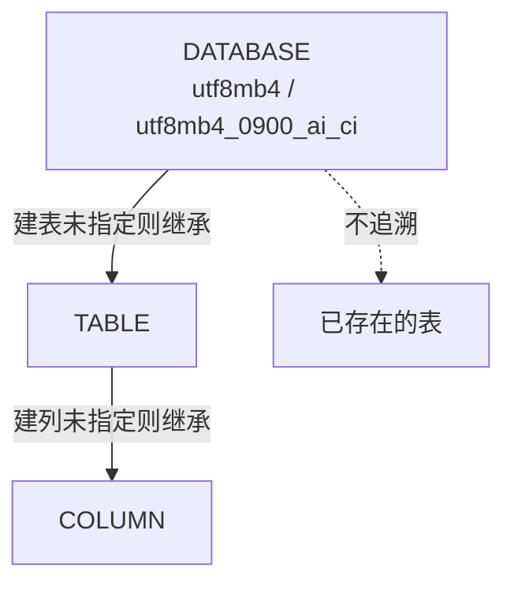

# 05. 建库语句里的字符集与排序规则

> **记录时间**：2026-09-16 17:22
> **编号**：05
> **标签**：#字符集 #排序规则 #utf8mb4 #建库 #MySQL8.0

---

## 一、问题

**原问题**：解释这句 SQL

```sql
CREATE DATABASE IF NOT EXISTS booker_data_service
  DEFAULT CHARACTER SET utf8mb4
  DEFAULT COLLATE utf8mb4_0900_ai_ci;
```

**面试场景**：一面 / 二面的基础题，但拉开差距的不是「能读懂」，而是**能不能说清 `utf8mb4` 与 `utf8` 的区别、`utf8mb4_0900_ai_ci` 名字里每个部分的含义，以及 `IF NOT EXISTS` 的静默陷阱**。面试官真正想确认的是：你有没有在真实项目里踩过字符集的坑。

---

## 二、答案

### 一句话结论

创建一个名为 `booker_data_service` 的库（已存在则跳过），默认字符集用 `utf8mb4` 以支持 4 字节字符，默认排序规则用 MySQL 8.0 新一代的 `utf8mb4_0900_ai_ci`（重音、大小写均不敏感）。

### 1. 是什么

逐段拆解：

| 片段 | 作用 | 可简写为 |
| ---- | ---- | ---- |
| `CREATE DATABASE` | 创建数据库；`CREATE SCHEMA` 完全等价 | — |
| `IF NOT EXISTS` | 幂等保护：已存在时不报错、不覆盖，只返回 warning | — |
| `booker_data_service` | 库名（小写下划线，命名规范） | — |
| `DEFAULT CHARACTER SET utf8mb4` | 库的默认字符集 | `CHARSET utf8mb4` |
| `DEFAULT COLLATE utf8mb4_0900_ai_ci` | 库的默认排序规则 | `COLLATE ...` |

`DEFAULT` 关键字是**纯冗余**（`CREATE DATABASE db CHARSET=utf8mb4` 等价），保留它是为了与 `mysqldump` 的输出格式保持一致。

`utf8mb4_0900_ai_ci` 这个名字本身就是说明书：

```text
utf8mb4 _ 0900 _ ai _ ci
   ↑       ↑     ↑    ↑
 字符集   Unicode  重音  大小写
        9.0.0   不敏感  不敏感
```

- **`0900`**：基于 **Unicode 9.0.0** 的 UCA（Unicode Collation Algorithm）排序算法，MySQL **8.0 才引入**
- **`ai`**：accent insensitive，`a` / `á` / `à` 视为相等
- **`ci`**：case insensitive，`A` / `a` 视为相等

因此在这个库下：

```sql
SELECT 'a' = 'á', 'A' = 'a', 'café' = 'cafe';
-- 结果全是 1
```

### 2. 为什么（底层原理）

#### 2.1 `utf8` 是 MySQL 造出来的「假 UTF-8」

| | 最大字节 | 能存 emoji | 实际身份 |
| ---- | ---- | ---- | ---- |
| `utf8` | 3 字节 | ❌ | `utf8mb3` 的废弃别名 |
| `utf8mb4` | 4 字节 | ✅ | 真正的 UTF-8 |

MySQL 早期实现 UTF-8 时，按照「一个字符最多 3 字节」设计（当时 Unicode 尚未扩展到辅助平面）。后来 Unicode 突破 3 字节上限，MySQL 只能在 5.5 中新增 `utf8mb4` 来真正支持 4 字节字符。改名会破坏存量系统，于是 `utf8` 这个错误命名被保留至今，直到 8.0 才把它标记为 `utf8mb3` 的别名并提示废弃。MySQL 8.0 的默认字符集已经改为 `utf8mb4`。

#### 2.2 为什么 8.0 放弃 `utf8mb4_general_ci`

`general_ci` 是「快但粗糙」的实现——排序时只取字符的部分信息做比较，导致某些字符的排序结果不符合 Unicode 规范（典型例子是德语 `ß` 与 `ss` 的排序关系）。`0900` 系列基于完整的 UCA 9.0.0 算法，比较和排序结果符合 Unicode 标准，同时在现代硬件上性能并不落后。MySQL 8.0 把它设为默认值，等于官方给出的定论。

#### 2.3 PAD SPACE 与 NO PAD（升级事故的高发区）

`_0900_` 系列是 **NO PAD**，而 `utf8mb4_general_ci` 是 **PAD SPACE**：

```sql
-- utf8mb4_general_ci（PAD SPACE）：尾部空格被忽略
SELECT 'abc' = 'abc ';   -- 1

-- utf8mb4_0900_ai_ci（NO PAD）：尾部空格参与比较
SELECT 'abc' = 'abc ';   -- 0
```

从 5.7 升到 8.0 时，如果表是重建的（collation 变成了 `_0900_`），原本能匹配的查询会突然匹配不上。

#### 2.4 库级设置只是「默认值」，继承链到这里为止



**已经建好的表不会跟着变**。库级字符集只对「之后新建、且自己没有指定字符集」的表生效。

### 3. 怎么用

建库后立即验证：

```sql
-- 看库的真实字符集和排序规则
SELECT SCHEMA_NAME, DEFAULT_CHARACTER_SET_NAME, DEFAULT_COLLATION_NAME
FROM INFORMATION_SCHEMA.SCHEMATA
WHERE SCHEMA_NAME = 'booker_data_service';

-- 直接对比两个 collation 的 PAD 属性差异
SELECT COLLATION_NAME, CHARACTER_SET_NAME, PAD_ATTRIBUTE, IS_DEFAULT
FROM INFORMATION_SCHEMA.COLLATIONS
WHERE COLLATION_NAME IN
  ('utf8mb4_0900_ai_ci', 'utf8mb4_general_ci', 'utf8mb4_unicode_ci');
```

第二条语句能直接看到 `PAD_ATTRIBUTE` 列——`utf8mb4_0900_ai_ci` 显示 `NO PAD`，`utf8mb4_general_ci` 显示 `PAD SPACE`。

如果库已存在但字符集不对，必须显式修改（`IF NOT EXISTS` 不会帮你改）：

```sql
ALTER DATABASE booker_data_service
  CHARACTER SET utf8mb4 COLLATE utf8mb4_0900_ai_ci;
```

### 4. 生产实践与坑

| 坑 | 现象 | 应对 |
| ---- | ---- | ---- |
| `utf8mb4_0900_ai_ci` 是 8.0 独有 | 5.7 上执行报 `ERROR 1273: Unknown collation` | 需兼容 5.7 时改用 `utf8mb4_unicode_ci` 或 `utf8mb4_general_ci` |
| `ai` 影响唯一索引去重 | `'cafe'` 与 `'café'` 被判重复，第二个插入报 `Duplicate entry` | 需区分时改用 `utf8mb4_0900_as_cs` 或 `utf8mb4_bin` |
| NO PAD 改变等值判断 | 升级到 8.0 后 `= 'abc'` 匹配不上 `'abc '` | 写入前 `TRIM()`，或迁移时评估存量数据 |
| 跨表 collation 不一致 | JOIN 报 `ERROR 1267: Illegal mix of collations` | 统一字符集；临时方案用 `ON` 条件显式 `COLLATE`（注意会破坏索引） |
| 大表 `CONVERT TO CHARACTER SET` | 锁表 + 索引前缀超限报错 | 用 `pt-online-schema-change` / `gh-ost`；转换前检查索引列长度（`utf8mb4` 下单字符 4 字节，`VARCHAR(255)` 索引可能超出 3072 字节限制） |

### 5. 面试官可能追问

**追问 1**：为什么 MySQL 要造 `utf8` 和 `utf8mb4` 两个名字？

- 答法：历史包袱。早期 UTF-8 实现按最多 3 字节设计，Unicode 扩展后只能新增 `utf8mb4` 支持 4 字节；改名影响存量系统，所以保留 `utf8` 这个错误命名，8.0 才用 `utf8mb3` 标记废弃。

**追问 2**：`utf8mb4_0900_ai_ci` 比 `utf8mb4_general_ci` 好在哪？

- 答法：`general_ci` 排序时只看字符的部分信息，结果不符合 Unicode 规范；`0900` 基于完整 UCA 9.0.0，排序准确且性能不落后。另外它是 NO PAD，语义更严格。

**追问 3**：线上表是 `latin1`，怎么安全改成 `utf8mb4`？

- 答法：不能直接 `ALTER TABLE ... CONVERT TO CHARACTER SET utf8mb4`——大表会锁住，且 **`utf8mb4` 单字符占 4 字节会让索引前缀长度膨胀**，可能超出 767/3072 字节限制而报错。正确做法是用 `pt-online-schema-change` 或 `gh-ost` 在线变更，变更前先检查所有索引列长度，必要时缩短 `VARCHAR` 或改用前缀索引。

---

## 三、举一反三

> 状态：待回答

**问题**：你按上面这句建好了 `booker_data_service` 库（`utf8mb4_0900_ai_ci`）。团队另一个老服务的数据表是从 MySQL 5.7 直接迁过来的，collation 是 `utf8mb4_general_ci`，也在同一个实例里。

现在要用一条 SQL 把这两张表 JOIN 起来，请回答：

1. 直接 JOIN 会发生什么？报错信息大致是什么内容？
2. 有哪几种修法？分别说出代价——特别说明：其中有一种修法会导致**索引失效**，是哪一种，为什么？
3. 如果直接把库的字符集改成某个统一值，能不能解决这两张已有表的问题？为什么？

### 我的回答

（待填写）

### 评分与点评

（待评分）
