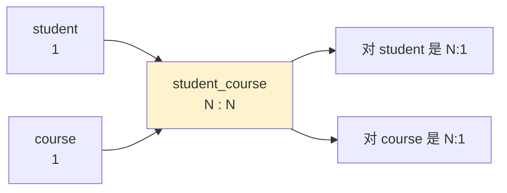

# 06. 关系型数据库中表的关联关系有哪几种

> **记录时间**：2026-09-16
> **编号**：06
> **标签**：#表设计 #ER模型 #外键 #范式 #JOIN

---

## 一、问题

关系型数据库中表的关联关系有哪几种？

**面试场景**：后端岗一轮的基础题，常作为「讲讲你们项目的表结构设计」的引子。面试官真正想考的是**你能不能把业务语义翻译成正确的表结构**——尤其是 M:N 是否知道用中间表、外键该放在哪一侧、以及背后 1NF 的理由。只背出「一对一、一对多、多对多」六个字是不及格的。

---

## 二、答案

### 一句话结论

三种基本关系：**一对一（1:1）、一对多（1:N）、多对多（M:N）**，外加一种特殊形式**自关联**（关系发生在同一张表内）。

### 1. 是什么

关联关系的学名是**基数（Cardinality）**，描述的是「A 表的一行能对应 B 表的几行」。

| 关系 | 语义 | 外键落点 | 关键约束 |
| ---- | ---- | ---- | ---- |
| **1 : 1** | A 一行 ↔ B 一行 | 任选一侧 | 外键列必须加 `UNIQUE` |
| **1 : N** | A 一行 ↔ B 多行 | **「多」的一侧** | 无额外约束 |
| **M : N** | 双向都是多行 | **第三张中间表** | 中间表两个外键，通常做联合主键 |

两点容易混淆的辨析：

- **1:N 和 N:1 是同一件事**，只是站立视角不同：站在用户角度看订单是 1:N，站在订单角度看用户是 N:1。
- **自关联不是第四种关系**，它是上述三种关系作用在**同一张表**上，靠外键指向本表主键实现（分类树、菜单树、员工-上级）。

### 2. 为什么（底层原理）

#### 关系模型用「公共属性」表达关联

关系模型（E.F. Codd, 1970）里没有指针，表与表之间**不存物理地址**，唯一的联系方式是**冗余存储一份对方的主键值**，查询时靠这个公共属性做匹配。这一列就叫**外键（Foreign Key）**。

这决定了关联的物理代价：**一次关联 = 一次索引查找**。所以关联字段必须建索引，否则 MySQL 只能走全表扫描或 Block Nested Loop，数据量一大就崩。


#### M:N 为什么必须落地成第三张表

这是**第一范式（1NF）**的直接推论：1NF 要求列的原子性，一个单元格里不能存多个值。若把商品 id 用逗号拼接存进订单表：

```text
order_id = 1001, product_ids = '3,5,8'   ← 违反 1NF
```

会产生四个致命问题：该列**无法有效索引**（`LIKE '%5%'` 走不了索引）、**无法 JOIN**、**无法加约束**（无法阻止写入不存在的商品 id）、**无法单独记录每个商品的数量与单价**。

引入中间表后，M:N 被拆成**两个 1:N**，每一侧都变成可以建索引、可以 JOIN、可以加约束的普通外键：



#### 1:1 为什么需要 UNIQUE

没有 `UNIQUE` 时，外键列允许重复，数据库无从阻止插入两条 `user_id = 1` 的详情记录，关系就退化成 1:N。**1:1 的全部实现细节，就在那个唯一索引上。**

#### 基数由业务语义决定，不是由 SQL 决定

同一对实体在不同业务下可以是不同关系：`user` 与 `order` 是 1:N，但 `user` 与 `user_detail`（身份证信息）是 1:1。设计前必须先问清业务规则，**没有标准答案**。

### 3. 怎么用

```sql
-- ① 1:1 —— 外键列加 UNIQUE（MySQL 8.0 / 5.7 通用）
CREATE TABLE user_detail (
  id      BIGINT PRIMARY KEY,
  user_id BIGINT NOT NULL,
  id_card VARCHAR(18),
  UNIQUE KEY uk_user_id (user_id),          -- 1:1 的关键
  CONSTRAINT fk_detail_user FOREIGN KEY (user_id) REFERENCES user(id)
) ENGINE=InnoDB;

-- ② 1:N —— 外键放在「多」的一方
CREATE TABLE `order` (
  id      BIGINT PRIMARY KEY,
  user_id BIGINT NOT NULL,
  KEY idx_user_id (user_id),                -- 关联字段必须建索引
  CONSTRAINT fk_order_user FOREIGN KEY (user_id) REFERENCES user(id)
) ENGINE=InnoDB;

-- ③ M:N —— 中间表，两个外键组成联合主键
CREATE TABLE student_course (
  student_id BIGINT NOT NULL,
  course_id  BIGINT NOT NULL,
  score      TINYINT,                       -- 中间表可以携带关系自身的属性
  PRIMARY KEY (student_id, course_id),      -- 同时防止重复选课
  KEY idx_course_id (course_id),            -- 反向查询也必须建索引
  CONSTRAINT fk_sc_student FOREIGN KEY (student_id) REFERENCES student(id),
  CONSTRAINT fk_sc_course  FOREIGN KEY (course_id)  REFERENCES course(id)
) ENGINE=InnoDB;

-- ④ 自关联 —— 外键指向本表主键
CREATE TABLE category (
  id        BIGINT PRIMARY KEY,
  name      VARCHAR(50) NOT NULL,
  parent_id BIGINT NULL,                    -- 根节点为 NULL
  KEY idx_parent_id (parent_id),
  CONSTRAINT fk_cat_parent FOREIGN KEY (parent_id) REFERENCES category(id)
) ENGINE=InnoDB;
```

> **版本差异**：MySQL 8.0.16 之前，M:N 中间表的联合主键若字段顺序为 `(student_id, course_id)`，则按 `course_id` 查询无法使用主键索引，必须单独建 `idx_course_id`。这一点在所有版本都成立，与版本无关，属于 B+ 树最左前缀原则。

### 4. 生产实践与坑

| 场景 | 设计建议 | 原因 |
| ---- | ---- | ---- |
| 用户主表 + 详情表 | 1:1 垂直拆分 | 把 `TEXT` 大字段、低频字段拆走，让主表更"瘦"，缓冲池能缓存更多热行 |
| 用户 → 订单 | 1:N，外键在订单侧 | 最经典的 1:N |
| 订单 ↔ 商品 | M:N → `order_item` 中间表 | 中间表要存**下单时的单价与商品名快照**，这是**刻意的反范式冗余** |
| 用户 ↔ 角色（RBAC） | M:N → `user_role` | 权限系统标配 |
| 分类 / 菜单 / 部门 | 自关联 `parent_id` | 树形结构；MySQL 8.0 可用 `WITH RECURSIVE` 递归查询 |
| 数据量大的树 | `parent_id` + **路径枚举 / 闭包表** | 自关联递归查询随层级加深性能指数级劣化 |

**典型坑**：

1. **只建了联合主键、漏建反向索引** —— 中间表按第二个字段查就全表扫描。
2. **把 M:N 硬做成 1:N**：用逗号拼接 id 存一列，短期省事，长期无法查询、无法约束、无法统计。
3. **1:1 忘记加 UNIQUE** —— 上线后静默退化成 1:N，直到出现重复数据才发现。
4. **关联字段类型不一致**：`user.id` 是 `BIGINT`，`order.user_id` 写成 `INT` 或一个有符号一个无符号，**索引失效**，且物理外键根本建不起来。
5. **JOIN 不是靠外键**：即使不建任何 `FOREIGN KEY` 约束，只要字段语义相同就能 `JOIN`。外键只负责**约束**，不负责**可连接性**。

### 5. 面试官可能追问

**追问 1：外键应该放在哪一侧？**

- 答法：**永远放在「多」的那一侧**。因为外键存的是对方的主键值，一行只能存一个值；如果放在「一」的一侧（比如 user 表存 order_ids），要么只能存一个订单 id，要么就得存多个值——违反 1NF，且无法索引。所以 1:N 的外键必然落在 N 侧，M:N 则只能新建中间表。

**追问 2：多对多能不能不用中间表？**

- 答法：不能。关系模型的列必须是原子的（1NF），一行里放不下「多个关联对象」。不用中间表就只能退化成 JSON 列或逗号拼接，代价是**丧失索引能力、丧失外键约束、丧失聚合查询能力**。中间表的本质是把 M:N 分解成两个可以各自建索引的 1:N。

**追问 3：`order_item` 里冗余了商品单价和商品名，这不违反第三范式吗？为什么还要这么设计？**

- 答法：确实违反 3NF（传递依赖于商品表）。但这是**有意的反范式冗余**：订单记录的是**下单那一刻的事实**，商品后续改价或改名不能篡改历史订单。若只存 `product_id` 实时 JOIN 取价，商品一改价，历史订单金额就全变了——财务对不上账。这类「快照字段」是电商系统的标准做法。

---

## 三、举一反三

> 状态：待回答

**问题**：接上一个问题。现在订单表数据量涨到 **10 亿行**，需要按 `user_id` 做分库分表（16 库 × 64 表），同时保留 `order_item` 中间表。

请回答：

1. 分片键选 `user_id` 后，`order_item` 应该按什么分片？如果要保证「查一个订单的所有订单项」不下推到多个分片，中间表需要冗余哪个字段？
2. 分库之后，原本 `order_item.order_id → order.id` 的这条关联还在同一台机器上吗？物理外键还能建吗？此时这条关联变成了什么？
3. 如果业务方新提出「按商家维度查所有订单」的需求，而分片键是 `user_id`，这条查询会怎样？给出至少一种解决方案，并说明代价。

### 我的回答

（待填写）

### 评分与点评

（待评分）
