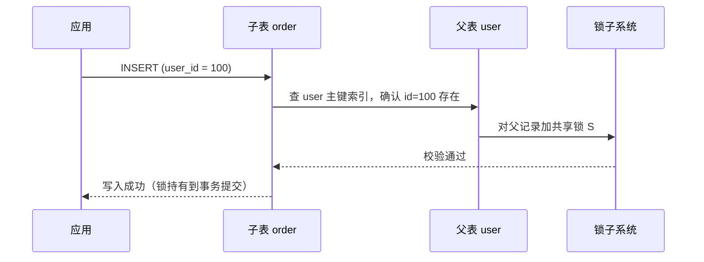
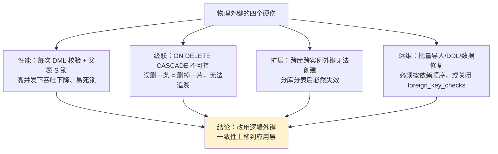

# 07. 什么是逻辑外键？什么是物理外键

> **记录时间**：2026-09-16
> **编号**：07
> **标签**：#外键 #数据一致性 #InnoDB #分库分表 #阿里规范

---

## 一、问题

什么是逻辑外键？什么是物理外键？

**面试场景**：中高级后端岗高频题，经常紧跟在「表关联关系」之后，或者由「你们项目的外键是怎么建的」引出。面试官真正想考的是**你有没有在真实高并发/分库分表场景下做过取舍**——只会说「外键保证一致性」的是初级，能讲清 InnoDB 外键的加锁代价、并能说出大厂为何禁用级联的，才是他想要的人。

---

## 二、答案

### 一句话结论

**物理外键**是数据库层面的 `FOREIGN KEY` 约束，由 InnoDB 强制校验；**逻辑外键**只在字段语义上存在关联，数据库不做任何校验，一致性由应用层代码保证。

### 1. 是什么

| 维度 | 物理外键（Physical FK） | 逻辑外键（Logical FK） |
| ---- | ---- | ---- |
| 存在形式 | 数据库里的**约束对象**，`SHOW CREATE TABLE` 可见 | 只是**字段约定**，DB 完全不知道两表有关 |
| 声明方式 | `FOREIGN KEY (col) REFERENCES t(id)` | 只建普通列 + 普通索引 |
| 一致性保障方 | **存储引擎**（InnoDB） | **应用代码 + 事务** |
| 写入校验 | 有，父记录不存在直接报错 1452 | 无，脏数据可以写进去 |
| 级联能力 | 原生支持 `ON DELETE CASCADE` 等 | 需手写，可控 |
| 性能 | 每条 DML 额外校验 + 加锁 | 更高，无额外开销 |
| 分库分表 | **不支持**（无法跨实例） | 支持 |
| 批量导入 / 迁移 | 需按依赖顺序，或临时关闭检查 | 无限制 |
| 脏数据风险 | 不可能出现孤儿数据 | 有，需定时对账兜底 |

**易混淆辨析**：

- **有无外键 ≠ 能否 JOIN**。JOIN 只要求字段语义匹配，与 `FOREIGN KEY` 约束无关。逻辑外键一样能 `JOIN`。
- **逻辑外键 ≠ 没索引**。逻辑外键必须**手动**建索引，否则 JOIN 和查询都会退化。物理外键则会被 InnoDB **自动**建索引。
- **MySQL 中只有 InnoDB 支持外键**。MyISAM 会解析 `FOREIGN KEY` 语法但**静默忽略**，不报错也不生效——这是经典陷阱。

### 2. 为什么（底层原理）

#### 物理外键在 InnoDB 内部做了什么

外键定义存放在**数据字典**中（MySQL 8.0 起是原子数据字典 `mysql.foreigns` / `mysql.foreign_column_usage`；5.7 及之前是 InnoDB 系统表 `SYS_FOREIGN`）。每次对子表写入时，InnoDB 会走一次**引用完整性检查**：



关键点在于**加锁**：校验通过后若不加锁，另一事务可能立刻把父记录删掉，导致出现孤儿数据。因此 InnoDB 必须对父表记录加**共享锁（S 锁）**并持有到本事务提交。

> **存在版本差异**：MySQL 8.0 起，当父表记录未处于被修改/删除标记状态时，外键检查可以走**非锁定读**以避免加锁；在此之前的实现是加 S 型 next-key 锁。具体行为受版本与隔离级别影响，面试时表述为「外键检查会对父记录加锁，8.0 起有非锁定读优化」即可。

由此带来三个直接后果：

1. **性能损耗**：每条子表 DML 多一次父表索引查找 + 一次加锁等待。
2. **死锁风险上升**：多个事务交叉插入子表、更新父表时，S 锁与 X 锁互相等待，极易形成死锁。
3. **级联雪崩**：`ON DELETE CASCADE` 由 InnoDB 内部递归执行，删一个用户可能连带删掉几十万订单，**不可中断、不可追溯、不写业务日志**。

#### 为什么大厂普遍禁用物理外键



《阿里巴巴 Java 开发手册》明确规定：**【强制】不得使用外键与级联，一切外键概念必须在应用层解决。**

#### 逻辑外键靠什么兜底

一致性责任从 DB 上移到应用层，需要三件事补齐：

1. **写入前校验**：创建订单前先查用户是否存在（注意放在同一事务内，用 `SELECT ... FOR UPDATE` 或依赖事务隔离避免竞态）。
2. **事务包裹**：跨表写入必须同一事务，避免部分成功。
3. **定时对账**：用离线 SQL 扫孤儿数据并告警修复——这是逻辑外键方案**不可省略**的一环。

### 3. 怎么用

```sql
-- ============ 物理外键 ============
CREATE TABLE `order` (
  id      BIGINT PRIMARY KEY,
  user_id BIGINT NOT NULL,
  CONSTRAINT fk_order_user FOREIGN KEY (user_id) REFERENCES user(id)
    ON DELETE CASCADE
    ON UPDATE CASCADE
) ENGINE=InnoDB;

-- 查看某个库的所有外键
SELECT constraint_name, table_name, column_name, referenced_table_name
FROM information_schema.KEY_COLUMN_USAGE
WHERE table_schema = 'shop'
  AND referenced_table_name IS NOT NULL;

-- 删除外键（注意：不会自动删除 InnoDB 自动创建的索引）
ALTER TABLE `order` DROP FOREIGN KEY fk_order_user;

-- 批量导入时临时关闭检查（导入完务必恢复）
SET FOREIGN_KEY_CHECKS = 0;
-- ... 导入 ...
SET FOREIGN_KEY_CHECKS = 1;


-- ============ 逻辑外键 ============
CREATE TABLE `order` (
  id      BIGINT PRIMARY KEY,
  user_id BIGINT NOT NULL,
  KEY idx_user_id (user_id)     -- 索引必须自己建
) ENGINE=InnoDB;

-- JOIN 照常工作，与是否有外键约束无关
SELECT o.id, u.name
FROM `order` o JOIN user u ON o.user_id = u.id
WHERE u.id = 100;

-- 兜底：定时对账，扫出指向不存在用户的孤儿订单
SELECT o.id, o.user_id
FROM `order` o
LEFT JOIN user u ON o.user_id = u.id
WHERE u.id IS NULL;
```

**物理外键的硬约束**（建不出来时会报错）：

- 两表必须都是 InnoDB
- 父表被引用列必须有索引（通常是主键或唯一索引）
- 外键列与引用列**类型、长度、字符集、校对规则必须完全一致**（`INT` vs `BIGINT`、有符号 vs 无符号都不行）

### 4. 生产实践与坑

| 场景 | 建议方案 | 原因 |
| ---- | ---- | ---- |
| 内部管理后台、配置表、数据量小 | **物理外键可用** | 并发低，强一致优先，开发省心 |
| 财务、账务核心表 | 物理外键或应用层强校验 | 不能容忍任何孤儿数据 |
| 互联网高并发业务（订单、用户） | **逻辑外键** | 性能优先，避免锁竞争与死锁 |
| 微服务架构 | **必须逻辑外键** | 数据在不同库甚至不同服务，物理上建不了 |
| 分库分表 / 计划分库分表 | **必须逻辑外键** | 跨实例外键无法创建 |
| 需要频繁数据迁移、刷数、补数 | **逻辑外键** | 免依赖顺序，可随时批量修数 |

**经典坑**：

1. **MyISAM 静默忽略外键**：写了 `FOREIGN KEY` 不报错，但约束从不生效。建表后务必 `SHOW CREATE TABLE` 确认引擎是 InnoDB。
2. **删外键 ≠ 删索引**：`DROP FOREIGN KEY` 后 InnoDB 自动创建的索引仍在，需要单独 `DROP INDEX`，否则留一个冗余索引。
3. **级联删除不激活触发器**：外键的 `ON DELETE CASCADE` 由 InnoDB 内部执行，**不会触发**父表或子表上的 `TRIGGER`。依赖触发器做审计日志的系统会静默丢日志。
4. **`TRUNCATE` 不受外键约束影响**：有外键引用的表无法 `TRUNCATE`，必须先删外键或改用 `DELETE`。
5. **逻辑外键的脏数据往往来自"绕过应用的写入"**：DBA 手工改库、数据修复脚本、离线导入。因此对账任务比想象中更重要。
6. **NestJS / ORM 场景**：TypeORM / Prisma 的 `@ManyToOne` 关系默认**不会**自动生成物理外键（Prisma 的 `relationMode = "prisma"` 更是纯逻辑关联）。要确认迁移文件里是否真的有 `FOREIGN KEY`，不要以为定义了关系就有约束。

### 5. 面试官可能追问

**追问 1：不用外键，数据一致性怎么保证？**

- 答法：三层兜底。① **应用层事务**：跨表写入放同一事务，写入前校验父记录存在；② **并发场景加锁**：用 `SELECT ... FOR UPDATE` 或依赖数据库唯一约束防止竞态；③ **离线对账**：定时跑 `LEFT JOIN ... IS NULL` 扫孤儿数据并告警修复。前两层防发生，第三层防漏网。逻辑外键的代价就是把"数据库替你把关"变成"你自己把关"，所以**对账任务不可省略**。

**追问 2：外键列上的索引是自动创建的吗？删掉外键后索引还在吗？**

- 答法：InnoDB 会**自动**为外键列创建索引（如果还没有合适的索引），因为引用完整性检查需要快速定位。**但 `DROP FOREIGN KEY` 不会自动删除这个索引**，需要手动 `DROP INDEX`。反之，想删掉有外键依赖的索引也会被拒绝，必须先删外键。

**追问 3：分库分表之后外键还有用吗？**

- 答法：完全失效。MySQL 的外键是**实例级**的，跨库、跨实例根本无法创建。分库分表后所有关联都只能是逻辑外键，由应用层通过分片键保证关联数据落在同一分片（例如订单与订单项都按 `user_id` 或 `order_id` 分片），一致性也只能靠应用层事务或对账保证。这也是大厂禁外键最硬的一条理由——**一旦计划分库分表，物理外键就是技术债**。

---

## 三、举一反三

> 状态：待回答

**问题**：假设你采用**逻辑外键**方案，现在要上线「用户注销」功能：删除用户时，需要清理其名下的**订单（最多 100 万条）、订单项、支付流水、优惠券**。

请回答：

1. 为什么不能简单地写一条 `DELETE FROM user WHERE id = ?` 再加几条 `DELETE` 级联清理？线上会出什么问题？
2. 你会如何设计这个删除流程（同步 / 异步、事务边界、分页清理）？请说明每个阶段数据库的状态。
3. 清理过程中用户又下了新订单，或者清理任务中途失败重试，如何保证不产生「残留孤儿数据」也不「误删新数据」？
4. 如果老板要求「用户注销后 7 天内可撤销恢复」，你的方案要怎么改？

### 我的回答

（待填写）

### 评分与点评

（待评分）
