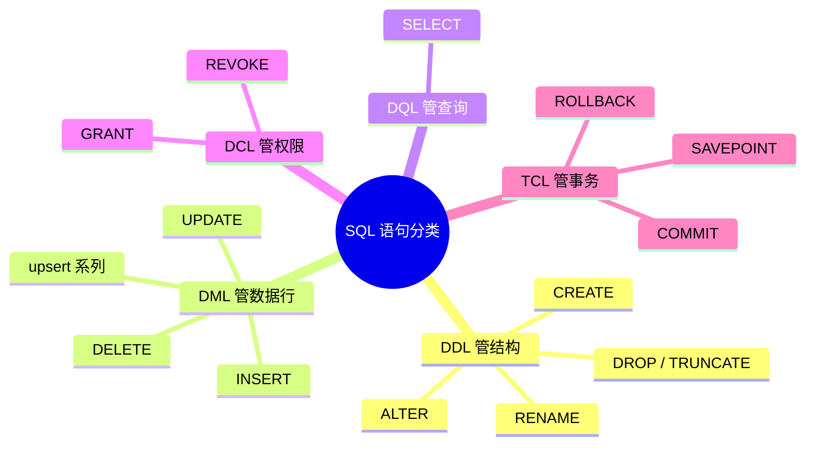
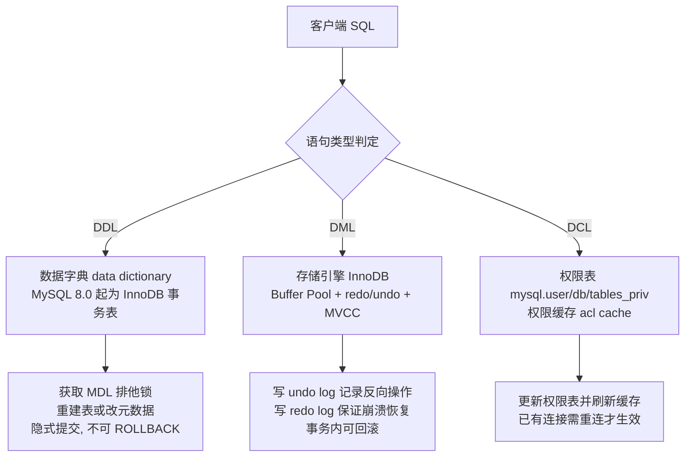

# 08. SQL 语言中 DDL、DML、DCL 是如何分类的？各有什么作用和语句？

> **记录时间**：2026-09-26
> **编号**：08
> **标签**：#SQL分类 #DDL #DML #DCL #元数据锁 #面试基础

---

## 一、问题

SQL 语言中 DDL、DML、DCL 是如何分类的？都有哪些作用，分别包含哪些语句？

**面试场景**：后端 / 数据开发岗的一面或二面开场题，几乎必问。这题的价值不在背出三个缩写，而在于面试官借它确认你是否具备**数据库分层思维**——是否清楚"改结构""改数据""改权限"在数据库内部是三套完全不同的子系统，进而引出元数据锁（metadata lock，MDL）、Online DDL、事务边界等深水区问题。答得浅的候选人往往只能背出 `CREATE/DROP`、`INSERT/UPDATE`，答得好的会主动把 `TRUNCATE` 归属、`SELECT` 归属、DDL 能否回滚这几个争议点讲清楚。

---

## 二、答案

### 一句话结论

按**操作对象的性质**划分：DDL 管结构、DML 管数据行、DCL 管权限，另加 DQL 管查询、TCL 管事务。

### 1. 是什么

SQL-92 标准把语句按操作对象分为若干类，工作中常用的是这五类：

| 类别 | 全称 | 操作对象 | 核心语句 | 是否受事务控制 |
| --- | --- | --- | --- | --- |
| DDL | Data Definition Language | 库/表/索引/视图等**对象结构**与元数据 | `CREATE`、`ALTER`、`DROP`、`TRUNCATE`、`RENAME` | 否，隐式提交 |
| DML | Data Manipulation Language | 表中的**数据行** | `INSERT`、`UPDATE`、`DELETE`、`REPLACE INTO`、`INSERT ... ON DUPLICATE KEY UPDATE`、`LOAD DATA` | 是，可 `COMMIT`/`ROLLBACK` |
| DQL | Data Query Language | 数据查询（不改变数据） | `SELECT`（含 `WHERE`/`JOIN`/`GROUP BY`/`HAVING`/`ORDER BY`/`LIMIT`） | 只读，通常不涉及写事务 |
| DCL | Data Control Language | **权限与安全** | `GRANT`、`REVOKE` | 否，立即生效 |
| TCL | Transaction Control Language | **事务边界** | `COMMIT`、`ROLLBACK`、`SAVEPOINT`、`SET TRANSACTION` | —— |

四个高频易错点，面试时主动讲出来就是加分项：

1. **`TRUNCATE` 属于 DDL，不是 DML**。它本质是"DROP + CREATE"（重建表），而不是逐行删除数据。
2. **`SELECT` 的归属有分歧**。标准 SQL 与多数教材把 `SELECT` 归入 DML（它确实"操作"数据），但因为它不修改数据、使用频率极高，实践中普遍单列为 DQL。面试时两种说法都要能自圆其说。
3. **`ALTER` 是 DDL，`UPDATE` 是 DML**。前者改列的元数据，后者改行里的值。
4. **`GRANT` 不是 DML**。它改的是 `mysql` 库中的权限表（8.0 起在数据字典中），不产生 undo log。



### 2. 为什么（底层原理）

分类不是人为的命名游戏，背后对应 MySQL 内部**三个不同的子系统**：



**为什么 DDL 不能回滚？**

- MySQL 8.0 之前，元数据散落在 `.frm`、`.par`、`.db.opt` 文件和 `mysql` 库的非事务表里，DDL 过程中会执行多次**隐式 COMMIT**（implicit commit），事务边界被打断，因此无法整体回滚。
- MySQL 8.0 引入**原子 DDL（atomic DDL）**：数据字典统一改为 InnoDB 事务表，DDL 的字典变更、redo、binlog 写入一个事务，保证**崩溃安全（crash-safe）**——DDL 执行到一半宕机，重启后要么完整、要么彻底回滚，不会留下半截表。
- 但 8.0 依然**不支持把 DDL 包在显式事务里 `ROLLBACK`**：`ALTER TABLE` 自身仍会触发隐式提交，把此前未提交的 DML 一起提交掉。这是面试最常设的陷阱。

**为什么 DML 能回滚？**

DML 走 InnoDB 的 WAL 与 MVCC：`UPDATE`/`DELETE` 会先把旧版本写入 **undo log**（回滚段），`COMMIT` 前数据对其他事务不可见或可通过 undo 恢复；`ROLLBACK` 就是按 undo log 反向执行。

**`TRUNCATE` 与 `DELETE` 的本质差异**（由分类属性直接决定）：

| 维度 | `TRUNCATE`（DDL） | `DELETE`（DML） |
| --- | --- | --- |
| 实现 | 重建表（DROP + CREATE） | 逐行打删除标记 |
| 回滚 | 不可回滚 | 事务内可回滚 |
| 表空间 | 立即释放，文件缩小 | 不释放，留下碎片（需 `OPTIMIZE TABLE`） |
| `AUTO_INCREMENT` | 重置为 1 | 保留当前最大值 |
| 触发器 | 不触发 | 逐行触发 |
| 外键 | 被其他表引用时直接失败 | 受 `ON DELETE` 规则约束 |
| binlog | 记一条 DDL 语句 | 记逐行变更（ROW 格式下） |

**为什么 DCL 立即生效且不可回滚？**

`GRANT` 修改的是权限表并刷新内存中的 ACL 缓存，不走 InnoDB 行事务。对**已存在的连接**，权限在连接建立时已载入会话，通常需要用户**重新连接**才生效（这与 `FLUSH PRIVILEGES` 只影响新连接是同一套机制）。

### 3. 怎么用

```sql
-- ============ DDL：改结构 ============
CREATE DATABASE shop DEFAULT CHARSET utf8mb4 COLLATE utf8mb4_0900_ai_ci; -- 8.0 默认排序规则
CREATE TABLE user (
  id   INT PRIMARY KEY AUTO_INCREMENT,
  name VARCHAR(50) NOT NULL,
  age  INT DEFAULT NULL,
  INDEX idx_age (age)
) ENGINE = InnoDB;

ALTER TABLE user ADD COLUMN phone VARCHAR(20) DEFAULT NULL;      -- 8.0.29+ 默认 ALGORITHM=INSTANT
ALTER TABLE user MODIFY COLUMN age TINYINT UNSIGNED;             -- 需要 COPY/INPLACE，会重建表
ALTER TABLE user DROP COLUMN phone;

TRUNCATE TABLE user;   -- DDL：清空并重置自增，不可回滚
DROP TABLE user;

-- ============ DML：改数据行 ============
START TRANSACTION;
INSERT INTO user (name, age) VALUES ('张三', 18), ('李四', 20);
UPDATE user SET age = 21 WHERE name = '张三';
DELETE FROM user WHERE age IS NULL;
INSERT INTO user (id, name) VALUES (1, '王五')
  ON DUPLICATE KEY UPDATE name = VALUES(name);   -- upsert
COMMIT;   -- 或 ROLLBACK 撤销上述全部操作

-- ============ DQL：查询 ============
SELECT age, COUNT(*) FROM user WHERE age > 18 GROUP BY age ORDER BY age LIMIT 10;

-- ============ DCL：权限 ============
CREATE USER 'dev'@'%' IDENTIFIED BY 'pwd';
GRANT SELECT, INSERT ON shop.* TO 'dev'@'%';
REVOKE INSERT ON shop.* FROM 'dev'@'%';
SHOW GRANTS FOR 'dev'@'%';

-- ============ TCL：事务 ============
SAVEPOINT sp1;
ROLLBACK TO SAVEPOINT sp1;
SET TRANSACTION ISOLATION LEVEL READ COMMITTED;
```

> **版本差异**：MySQL 8.0 之前 `INSTANT` 算法不可用，大表加列会触发表重建；8.0.29 起 `ALTER TABLE ... ADD COLUMN` 默认 `ALGORITHM=INSTANT`，只改元数据、秒级完成。

### 4. 生产实践与坑

| 场景 | 建议 | 原因 |
| --- | --- | --- |
| 大表加字段 | 优先 `ALGORITHM=INSTANT, LOCK=NONE`；不支持时用 `pt-online-schema-change` / `gh-ost` | 直接 `ALTER` 会重建表并持 MDL 写锁，阻塞全表读写 |
| DDL 执行前 | `SELECT * FROM information_schema.innodb_trx` 确认无长事务 | 长事务持有的 MDL 读锁会阻塞 DDL，DDL 排队后又阻塞后续所有查询，引发雪崩 |
| 事务里混写 DDL 和 DML | 严格禁止 | DDL 触发隐式提交，会把之前未提交的 DML 一起提交，破坏原子性 |
| 需要清空表 | 明确需求：要重置自增、释放空间用 `TRUNCATE`；要可回滚、要触发删除逻辑用 `DELETE` | 两者语义完全不同，`TRUNCATE` 在生产不可撤销 |
| 应用账号权限 | 按最小权限授予，禁止业务用 `root` | DCL 不可回滚，权限一旦放出去就是长期风险面 |
| ORM 自动迁移（如 TypeORM `synchronize`） | 生产必须关闭，改用版本化迁移脚本 | 隐式 DDL 在无人值守时执行，风险等同于线上直接 `ALTER` |

### 5. 面试官可能追问

**追问 1**：`TRUNCATE`、`DELETE`、`DROP` 三者有什么区别？

- 答法：先给分类——`TRUNCATE` 和 `DROP` 是 DDL，`DELETE` 是 DML。再按"删了什么"区分：`DROP` 删结构+数据，`TRUNCATE` 只删数据保留结构，`DELETE` 删行（可带条件）。最后落到机制：`TRUNCATE` 不可回滚、释放空间、重置自增、不触发触发器；`DELETE` 可回滚、不释放空间、逐行触发。

**追问 2**：DDL 为什么不能回滚？MySQL 8.0 之后呢？

- 答法：8.0 前数据字典基于文件和非事务表，DDL 过程中多次隐式提交，无法回滚；8.0 引入原子 DDL，数据字典迁入 InnoDB，DDL 具备崩溃安全性（宕机不会留下半截表），但 DDL 本身仍会隐式提交，不能被 `ROLLBACK` 撤销，也不能和用户事务混写。

**追问 3**：`SELECT` 到底算 DML 还是 DQL？

- 答法：SQL 标准把它算作 DML 中的数据操作（data manipulation），因为查询也是数据操作的一种；但工程中因为 `SELECT` 不修改数据、不涉及事务提交，通常单列为 DQL。面试时补一句"两种说法都有依据，取决于你采用哪种划分粒度"，比只背一种更稳。

---

## 三、举一反三

> 状态：待回答

**问题**：线上有一张 5000 万行的 InnoDB 表。此时存在一个跑了 30 分钟仍未提交的事务（里面只有几条 `SELECT`），你随后执行 `ALTER TABLE t ADD COLUMN remark VARCHAR(100)`。请描述接下来会发生什么现象、背后的锁机制是什么；如果把这条 `ALTER` 换成一条 `UPDATE t SET a = 1`（同样跑很久），现象又有什么不同？为什么？

### 我的回答

（待填写）

### 评分与点评

（待评分）
</content>
