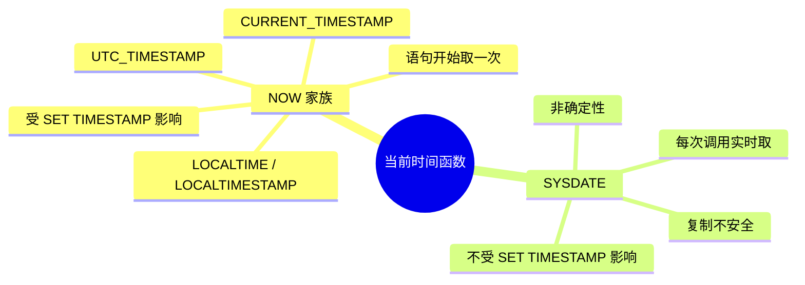
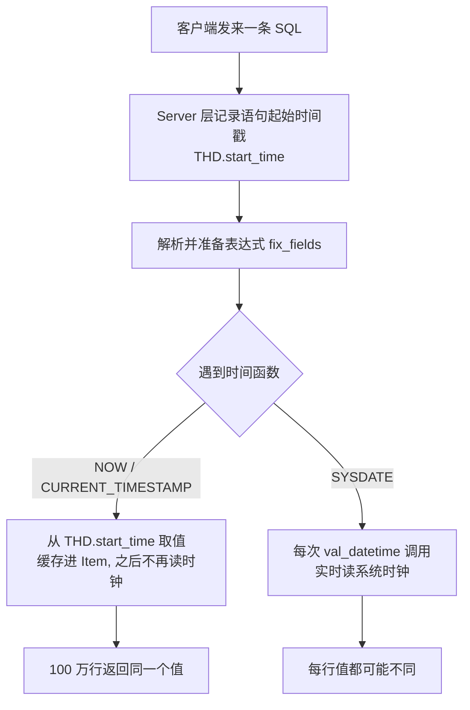
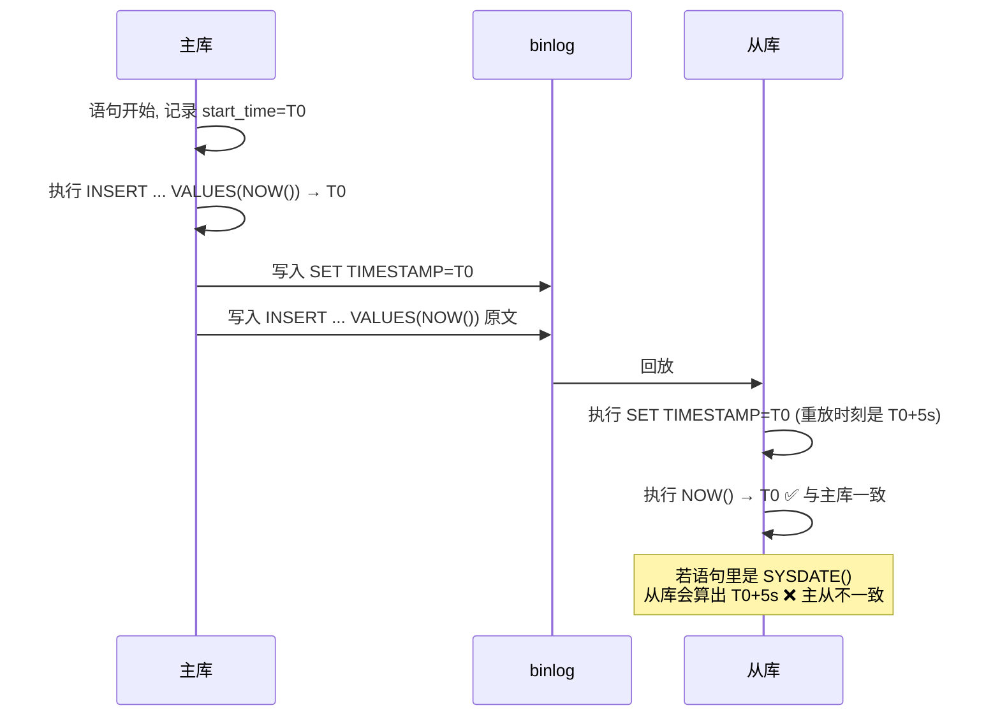

# 09. NOW() 与 SYSDATE() 的求值时机有什么区别？

> **记录时间**：2026-09-27
> **编号**：09
> **标签**：#时间函数 #NOW #SYSDATE #确定性函数 #主从复制 #binlog

---

## 一、问题

「NOW() 是语句级一次求值，SYSDATE() 是调用时求值」这句话到底是什么意思？

**面试场景**：后端岗一面/二面的细节题，通常从「你怎么给 `created_at` 赋值」「主从数据为什么不一致」这类场景顺带引出。面试官真正想考的不是两个函数的返回值差几秒，而是你是否具备**语句级语义（statement-level semantics）**与**函数确定性（determinism）**的意识——这是理解 binlog 复制、执行计划常量折叠、慢查询时间偏差的一条共同底层线索。只会背「SYSDATE 更精确」的候选人，追问到「主从为什么不一致」就会露馅。

---

## 二、答案

### 一句话结论

`NOW()` 在**语句开始时**取一次时间并全程复用；`SYSDATE()` 每次调用都实时读系统时钟，因此是非确定性函数。

### 1. 是什么

| 维度 | `NOW()` | `SYSDATE()` |
| --- | --- | --- |
| 求值时机 | 语句开始执行一次，之后整条语句内固定 | 每次真正执行到该函数时实时取 |
| 同一语句多次调用 | 返回值**完全相同** | 返回值**可能不同** |
| 确定性 | 语句内确定（deterministic） | 非确定（non-deterministic） |
| 受 `SET TIMESTAMP` 影响 | 是 | 否 |
| 主从复制（STATEMENT 格式） | 安全，binlog 记录时间戳可还原 | **不安全**，主从结果不一致 |
| 优化器 | 可当作常量折叠，参与范围估算 | 不能折叠，无法预估 |
| 家族成员 | `CURRENT_TIMESTAMP`、`CURRENT_TIMESTAMP()`、`LOCALTIME`、`LOCALTIMESTAMP`、`UTC_TIMESTAMP()` | 无同义词 |

关键点有三个，面试时主动讲出来就是加分项：

1. **`NOW()` 是「语句级」，不是「事务级」**。一个长事务里的 `BEGIN;` 之后，每条 SQL 各有各的 `NOW()`，互不相同。很多人误以为是事务开始时间。
2. **`SYSDATE()` 是 MySQL 日期时间函数里唯一的例外**。除它之外所有取当前时间的函数都是语句级一次求值。
3. **`SYSDATE()` 的「精确」是有代价的**，代价就是破坏可复制性。



### 2. 为什么（底层原理）

**机制一：值来自哪里**

MySQL  server 层为每个连接维护一个 `THD`（thread handler）对象，其中保存着**当前语句的起始时间戳**（`start_time` / query start）。两类函数读取的数据源根本不同：

- `Item_func_now` 在表达式准备阶段（`fix_length_and_dec()`）就从 `THD` 的语句起始时间戳取值并**缓存进 Item 对象**；后续每行求值直接返回缓存值，不再读时钟。
- `Item_func_sysdate` 每次 `val_datetime()` 都调用底层系统时钟函数（`my_micro_time()` 级别）实时取当前时间，不做任何缓存。



这就是「语句级一次求值」与「调用时求值」的全部真相：**一个读的是语句开始时拍下的快照，一个读的是执行当下的时钟。**

**机制二：为什么要这样设计 —— 复制的正确性**

基于语句的复制（statement-based replication，SBR）中，从库拿到的是主库执行过的**同一条 SQL 文本**。要保证主从数据一致，这条 SQL 在主从两端的执行结果必须完全一样，因此**语句中任何"取当前时间"的行为都必须可复现**。

MySQL 的做法：把语句起始时间戳作为一个 `SET TIMESTAMP=<值>` 事件写在 binlog 中该语句之前。从库重放时先执行 `SET TIMESTAMP`，再执行 SQL，于是 `NOW()` 还原出主库当时的时刻，主从一致。



`SYSDATE()` 不读 `start_time`，因此 `SET TIMESTAMP` 对它完全无效 —— 主库 10:00:00 写入的值，从库 10:00:05 重放就会写成 10:00:05。**MySQL 官方把 `SYSDATE()` 明确列为 statement-based replication 下的 unsafe 语句**。

**机制三：优化器视角**

`NOW()` 在单条语句内等价于常量，优化器可以做**常量折叠（constant folding）**：`WHERE create_time > NOW() - INTERVAL 7 DAY` 会先算出一个确定的时间点，再用它对索引做 range 估算，得到合理的 rows 预估与执行计划。
`SYSDATE()` 每次值都不同，无法折叠，优化器拿不到确定的边界值，只能退化成更保守的估算，可能选错索引或放弃范围扫描。

**版本与参数事实**

- `sysdate_is_now` 系统变量（默认 `OFF`）：置为 `1` 后 `SYSDATE()` 完全退化为 `NOW()` 的同义词，复制重新变得安全。这是官方给出的兼容方案。
- `binlog_format` 自 MySQL 5.7.7 起默认为 `ROW`。ROW 格式下主库直接把计算出的**具体值**写入行镜像，从库照抄该值，因此 `SYSDATE()` 的复制风险被规避；只有在显式使用 `STATEMENT` 格式时该问题才致命。
- `binlog_format=MIXED` 时对 unsafe 语句会自动切换为 ROW 格式并记录警告。

### 3. 怎么用

```sql
-- ============ 实验一：证明 NOW() 是语句级快照 ============
SELECT NOW(), SLEEP(3), NOW();
-- 第 1 列与第 3 列完全相同（都是语句开始时刻）

SELECT SYSDATE(), SLEEP(3), SYSDATE();
-- 第 1 列与第 3 列相差约 3 秒

-- ============ 实验二：多行场景 ============
SELECT id, NOW() AS n, SYSDATE() AS s FROM big_table LIMIT 100000;
-- n 列：10 万行完全一致
-- s 列：随查询推进逐步变大

-- ============ 实验三：SET TIMESTAMP 只影响 NOW()（最有力的证据）============
SET TIMESTAMP = UNIX_TIMESTAMP('2020-01-01 00:00:00');
SELECT NOW(), SYSDATE();     -- NOW() = 2020-01-01 00:00:00；SYSDATE() 仍是真实当前时间
SET TIMESTAMP = DEFAULT;     -- 记得还原

-- ============ 实验四：NOW() 是语句级，不是事务级 ============
START TRANSACTION;
SELECT NOW();                -- T0
SELECT SLEEP(3);
SELECT NOW();                -- T0 + 3s，与上一次不同 → 证明是「语句」级而非「事务」级
COMMIT;

-- ============ 实验五：小数秒精度（两者都支持 fsp 0~6）============
SELECT NOW(6), SYSDATE(6);

-- ============ 生产写法：让数据库统一生成时间 ============
CREATE TABLE orders (
  id         BIGINT PRIMARY KEY AUTO_INCREMENT,
  created_at DATETIME(3) NOT NULL DEFAULT CURRENT_TIMESTAMP(3),
  updated_at DATETIME(3) NOT NULL DEFAULT CURRENT_TIMESTAMP(3)
                         ON UPDATE CURRENT_TIMESTAMP(3)
) ENGINE = InnoDB;

-- 时间范围筛选：用 NOW()，保证区间两端是同一时刻
SELECT * FROM orders
WHERE created_at >= NOW() - INTERVAL 1 HOUR
  AND created_at <  NOW();
```

> **版本差异**：`SET TIMESTAMP` 影响 `NOW()`/`CURDATE()`/`UTC_TIMESTAMP()`，不影响 `SYSDATE()`，各版本行为一致；`sysdate_is_now` 在 5.x 与 8.0 均可用。

### 4. 生产实践与坑

| 场景 | 建议 | 原因 |
| --- | --- | --- |
| `created_at` / `updated_at` 等所有业务时间字段 | 一律用 `NOW()` 或 `DEFAULT CURRENT_TIMESTAMP` | 值可复现、主从一致、可被优化器折叠 |
| binlog 格式为 `STATEMENT` 的集群 | 禁用 `SYSDATE()`，或设 `sysdate_is_now = 1` | `SYSDATE()` 是官方认定的 unsafe 语句，直接导致主从数据不一致 |
| 跑 5 秒的慢 `UPDATE` 里写 `paid_at = NOW()` | 明确接受它记的是**语句开始**时刻，需要实际执行时刻才用 `SYSDATE()` | `NOW()` 会偏早数秒，对账类场景要提前评估 |
| 批量 `INSERT ... SELECT` 十万行 | 用 `NOW()` 保证整批时间一致 | 用 `SYSDATE()` 会让同一批数据的时间戳横跨整个执行过程，按时间切片统计会错乱 |
| 时间区间查询的两端边界 | 两端都用 `NOW()` | 用 `SYSDATE()` 时左右边界是两个不同时刻，区间会漂移，可能漏/重数据 |
| 排查慢查询、审计「这一步实际几点执行到」 | 可用 `SYSDATE()` | 接受非确定性，仅用于诊断，不写入业务数据 |
| 按时间分区表的分区裁剪 | 用 `NOW()` | 语句级常量可被优化器用于裁剪分区；`SYSDATE()` 不能 |
| 应用侧（NestJS + TypeORM `@CreateDateColumn`） | 优先让 DB 生成（DB 默认值），或全链路统一 NTP 时钟 | 应用服务器各自生成时间会带来时钟漂移，多实例部署下同一批数据时间不一致 |

### 5. 面试官可能追问

**追问 1**：长事务里，`NOW()` 返回的是事务开始时间吗？

- 答法：不是。`NOW()` 是**语句级**，不是事务级。`BEGIN` 之后每条 SQL 各自取各自的语句开始时间；同一条 SQL 内部才共享同一个值。题干里那句「语句级一次求值」的「语句」二字就是这个意思。

**追问 2**：binlog 是怎么保证主从 `NOW()` 一致的？ROW 格式下还需要吗？

- 答法：STATEMENT 格式下，MySQL 在该语句前写一条 `SET TIMESTAMP=<语句起始时间戳>` 事件，从库重放时先把会话时间戳设成主库的值，再执行 SQL，`NOW()` 自然还原出主库时刻。ROW 格式下主库直接把算出的具体值写进行镜像，从库照抄，因此不依赖 `SET TIMESTAMP`，`SYSDATE()` 的问题也随之消失。5.7.7 起默认就是 ROW。

**追问 3**：那为什么不全都做成实时求值，要得那么"精确"？

- 答法：因为一条 SQL 需要**语句内语义一致**。如果 `WHERE create_time BETWEEN f() AND f()` 的左右边界是两个实时时刻，区间就会漂移，批量写入的十万行也会拿到十万个不同时间戳——数据既不可复现、也无法复制、优化器还无法估算。语句级一次求值换来的是可复现性、可复制性和可优化性，这三点比"精确到执行那一刻"重要得多。

**追问 4**：`SYSDATE()` 对执行计划有什么影响？

- 答法：`NOW()` 在语句内是常量，优化器可常量折叠，把 `NOW() - INTERVAL 7 DAY` 算成确定值去做索引 range 的 rows 预估，甚至用于分区裁剪；`SYSDATE()` 无法折叠，优化器拿不到确定边界，只能做保守估算，可能放弃本该走的索引。

---

## 三、举一反三

> 状态：待回答

**问题**：线上订单表 `orders` 有 8000 万行，`create_time` 上有二级索引。该集群的 `binlog_format = STATEMENT`，从库比主库慢 40 秒。现在有一个对账 SQL 在主库执行：

```sql
SELECT COUNT(*) FROM orders
WHERE create_time >= SYSDATE() - INTERVAL 1 HOUR;
```

请回答：
1. 这条 SQL 在主库和从库（延迟 40 秒后重放）上分别会扫到什么范围的数据？两者的 COUNT 值会相差多少，为什么？
2. 把 `SYSDATE()` 换成 `NOW()` 之后，主从结果是否完全一致？此时 binlog 里发生了什么？
3. 如果 DBA 把 `binlog_format` 改成 `ROW`，第 1 问的结论会变吗？为什么？
4. 如果业务要求「统计最近一小时」且必须主从一致，你会怎么改写这条 SQL？

### 我的回答

（待填写）

### 评分与点评

（待评分）
