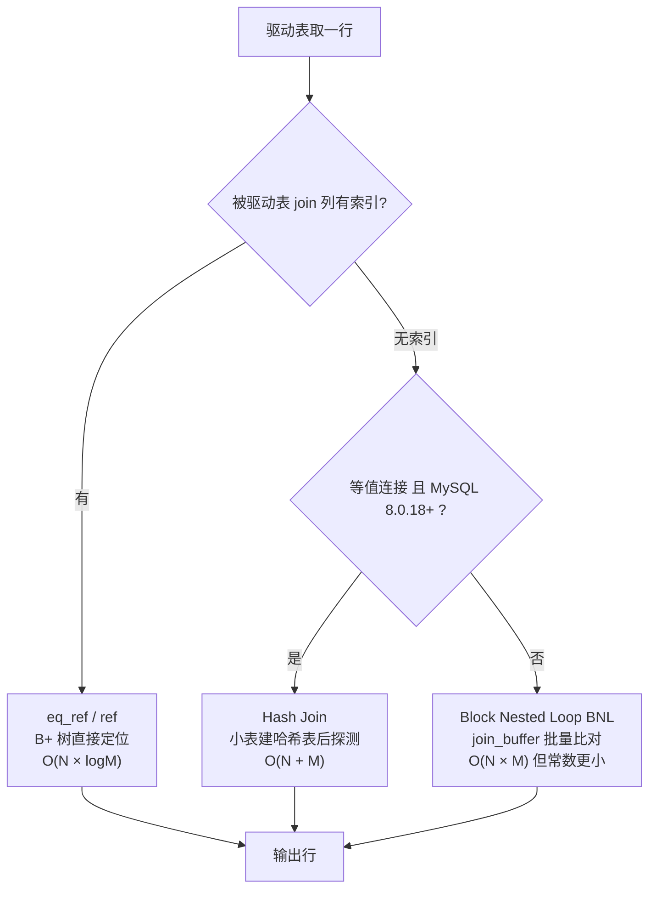

# 10. 多表 JOIN 在 MySQL 底层是怎么执行的？真的会跑三重循环吗？

> **记录时间**：2026-09-28
> **编号**：10
> **标签**：#多表查询 #NestedLoopJoin #HashJoin #joinbuffer #执行计划

---

## 一、问题

用三层嵌套 `for` 循环（员工 → 部门 → 地点，靠 `if` 比对外键）来类比 MySQL 的三表 `JOIN`，这个理解对吗？MySQL 真的是这样执行的吗？

**面试场景**：后端岗二面，考察候选人是否只停留在"会写 JOIN 语法"。面试官真正想听的是**连接算法的实现层次**：嵌套循环连接（Nested Loop Join，NLJ）的概念模型 + 索引查找 / Hash Join / join buffer 三种优化路径。能说出"被驱动表的 join 列必须有索引"背后原因的候选人，才算真的懂。

---

## 二、答案

### 一句话结论

三层嵌套循环是 JOIN 的**语义模型**，MySQL 真实执行时用索引查找、Hash Join、join buffer 把 O(N×M×K) 压到 O(N×logM)。

### 1. 是什么

SQL 的连接在逻辑上等价于「外层取一行 → 内层逐行匹配 → 条件成立就输出」，这就是**嵌套循环连接（Nested Loop Join，NLJ）**。`ON` 后面写的等值条件，就是循环体里那个 `if`。

```sql
SELECT e.first_name, d.department_name, l.city
FROM employees e
JOIN departments d ON e.department_id = d.department_id   -- 第一个 if
JOIN locations   l ON d.location_id  = l.location_id;     -- 第二个 if
```

这里用的是 `INNER JOIN`，语义是"三段都匹配上才输出"，等价于循环里"匹配不上就不 push"。若要保留左表全量，必须用 `LEFT JOIN`（匹配不上填 NULL 也要产生一行）。

### 2. 为什么（底层原理）

MySQL 不会老老实实跑三重循环，优化器按代价在三条路径中选：



**三种实现对比**：

| 算法 | 触发条件 | 复杂度 | JS 类比 |
|---|---|---|---|
| 索引查找（eq_ref / ref） | 被驱动表 join 列有索引 | O(N × logM) | 把内层 `for` 换成 `Map.get()` |
| Block Nested Loop | 无索引，8.0.18 之前 | O(N × M)，但批量比对减少函数调用 | 内层全表扫，但一次比一批 |
| Hash Join | 无索引的等值连接，8.0.18 起 | O(N + M) | 先 `new Map()` 建哈希表，再 O(1) 探测 |

因为 `departments.department_id` 和 `locations.location_id` 都是主键，这条 SQL 真实执行走的是**索引查找路径**，等价的 JS 应该是：

```js
// 预建"索引"：一次 O(N) 建表，此后每次 O(1)
const depById = new Map(deps.map(d => [d.id, d]));
const locById = new Map(locs.map(l => [l.id, l]));

const res = [];
for (const emp of emps) {
  const dep = depById.get(emp.depid);
  if (!dep) continue;               // INNER JOIN 语义
  const loc = locById.get(dep.locId);
  if (!loc) continue;
  res.push({ emp_name: emp.name, dep_name: dep.name, loc_name: loc.name });
}
```

复杂度从 O(N×M×K) 降到 O(N+M+K)。**这就是"给 join 字段建索引"的本质收益。**

**驱动表与 join order**：三表连接时 MySQL 按代价估算决定谁做驱动表，不保证按书写顺序执行。`EXPLAIN` 结果从上到下的顺序就是实际 join 顺序。

### 3. 怎么用

```sql
-- 看执行计划：type 是关键指标
EXPLAIN SELECT e.first_name, d.department_name, l.city
FROM employees e
JOIN departments d ON e.department_id = d.department_id
JOIN locations   l ON d.location_id  = l.location_id;
```

`type` 列的含义：

| type | 含义 | 评价 |
|---|---|---|
| `eq_ref` | 主键/唯一键命中，最多返回一行 | 最优 |
| `ref` | 非唯一索引等值匹配 | 良好 |
| `range` | 索引范围扫描 | 可接受 |
| `index` | 全索引扫描 | 需要关注 |
| `ALL` | **全表扫描**，三重循环原样发生 | 告警信号 |

`key` 列显示实际用到的索引；`rows` 是预估扫描行数。

> **版本差异**：MySQL 8.0.18 之前没有 Hash Join，无索引的大表等值连接只能走 BNL，性能极差；8.0.18 起优化器自动改用 Hash Join。8.0 之前 `EXPLAIN FORMAT=TREE` 不可用，只能靠 `EXPLAIN` 的 `Extra` 列判断。

### 4. 生产实践与坑

| 场景 | 建议 | 原因 |
|---|---|---|
| 外键字段（如 `employees.department_id`） | **必须建索引** | 一旦它被当被驱动表，无索引就退化成全表扫描 + BNL |
| 谁做驱动表 | 小表驱动大表，让大表走索引 | 驱动表必然被全扫描，行数越少代价越低 |
| 优化器选错驱动表 | 用 `STRAIGHT_JOIN` 强制按书写顺序 | 统计信息过期时会选错 |
| `ON` 里写 `OR` | 严格禁止 | `OR` 让连接条件无法走 `eq_ref`，`type` 从 `eq_ref` 退化成 `ALL`，语义和性能双输 |
| join 列字符集/类型不一致 | 统一为相同类型与 collation | 类型不匹配会导致隐式转换，索引直接失效 |
| 三表以上大表连接 | 拆成多次查询在应用层拼 | 减少优化器选错计划的概率，也便于缓存 |

实测（MySQL 9.3.0 / `atguigudb`）：给 `ON` 条件加上 `OR e.department_id IS NULL` 后，原本走 `eq_ref` 的连接会退化为全表扫描。

### 5. 面试官可能追问

**追问 1**：被驱动表的 join 列没索引会怎样？

- 答法：MySQL 只能用 Block Nested Loop，把驱动表若干行塞进 `join_buffer`，被驱动表每取一行就在缓冲区里比对一批。复杂度 O(N×M)，大表上表现为连接慢、`EXPLAIN` 里 `type=ALL` 且 `Extra` 出现 `Using join buffer (Block Nested Loop)`。8.0.18 之后会改用 Hash Join，但建哈希表本身也要吃 `join_buffer_size` 内存，超了会落盘。

**追问 2**：MySQL 是固定按 SQL 书写顺序连接吗？

- 答法：不是。优化器基于统计信息估算代价来选择 join order，`EXPLAIN` 结果的顺序才是真实顺序。想强制顺序用 `STRAIGHT_JOIN`，但这是兜底手段，优先应保证统计信息准确（`ANALYZE TABLE`）。

**追问 3**：`INNER JOIN` 和 `LEFT JOIN` 在结果行数上有什么关系？

- 答法：`LEFT JOIN` 保证左表每一行"至少产出一行"，所以行数只会 ≥ 之前的连接结果，不会因为匹配不上而丢行；`INNER JOIN` 只保留匹配成功的行。但两者都不保证"只产出一行"——被驱动表匹配到多行时行数照样膨胀。

---

## 三、举一反三

> 状态：待回答

**问题**：有一张 5000 万行的订单表 `orders`（字段：`order_id`、`user_id`、`shop_id`、`status`、索引只有主键）和一张 200 万行的用户表 `users`（主键 `user_id`）。执行 `SELECT * FROM orders o JOIN users u ON o.user_id = u.user_id WHERE o.status = 1` 时：

1. MySQL 大概率会选谁做驱动表？为什么？
2. 如果 `WHERE o.status = 1` 能过滤掉 95% 的行，但 `status` 列上没有索引，连接算法会怎么退化？
3. 此时应该给 `orders` 加什么索引？加了之后连接算法和执行顺序会发生什么变化？

### 我的回答

（待填写）

### 评分与点评

（待评分）
</content>
