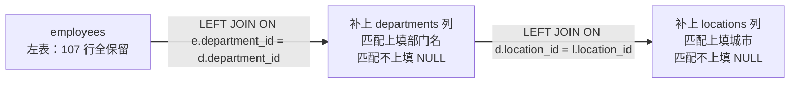

# 11. `LEFT JOIN` 后面到底该放哪张表？连续多个 `LEFT JOIN` 是什么意思？

> **记录时间**：2026-09-28
> **编号**：11
> **标签**：#外连接 #LEFTJOIN #ON与WHERE #NULL行

---

## 一、问题

1. `LEFT JOIN` 后面到底该写哪张表？比如"哪怕员工没有 `department_id`，我也要员工信息"，该怎么写？
2. 连续写多个 `LEFT JOIN` 是什么含义？

**面试场景**：一面 SQL 基础题，关键在于候选人是否理解**左右表的不对称语义**，以及能否识破 `ON` 与 `WHERE` 的差异导致外连接失效这个经典陷阱。稍加追问就能区分"会写 JOIN"和"理解 JOIN"。

---

## 二、答案

### 一句话结论

**想全量保留的表放左边（`FROM` 后面），`LEFT JOIN` 后面放"可以缺"的表**；多个 `LEFT JOIN` 是从左往右逐层补列，某层补不上就填 NULL 且不丢行。

### 1. 是什么

`A LEFT JOIN B` 的语义：A 一行都不能少；B 匹配得上就补上 B 的列，匹配不上就把 B 的列填 NULL。



语法上是**左结合**的链式展开：`A LEFT JOIN B LEFT JOIN C` = `(A LEFT JOIN B) LEFT JOIN C`。

> `A RIGHT JOIN B` 完全等价于 `B LEFT JOIN A`。工程上统一只用 `LEFT JOIN`，看到 `RIGHT JOIN` 在脑内翻转一次即可，不要混写。

### 2. 为什么（底层原理）

外连接的核心性质是**行数单调不减**：每加一层 `LEFT JOIN`，结果行数只会 ≥ 上一层，因为它保证左边每一行"至少产出一行"。这与 `INNER JOIN` 的"可能丢行"形成对比。

三层链式的角色划分：

| 表 | 角色 | 缺失时表现 |
|---|---|---|
| `employees` | 主表，全量保留 | —— |
| `departments` | 第 1 个可选维度 | `department_name` 为 NULL |
| `locations` | 第 2 个可选维度 | `city` 为 NULL |

实测（`atguigudb`，`employee_id=178` 的 Grant 无部门）：

| emp_name | dep_name | loc_name |
|---|---|---|
| King | Executive | Seattle |
| Grant | NULL | NULL |

**为什么"没部门"这行不会在后续连接中丢失**：因为 `LEFT JOIN` 只要左表有行就产出，右表匹配不上直接补 NULL，不做过滤。这正是外连接与内连接在**执行逻辑**上的差异点。

### 3. 怎么用

**三步判断法**：

| 问题 | 结论 |
|---|---|
| 哪张表的行绝对不能丢？ | 放 `FROM` 后面（最左） |
| 哪张表可能匹配不上？ | 放 `LEFT JOIN` 后面 |
| 哪张表必须匹配上，否则该行无意义？ | 用 `INNER JOIN`（直接写 `JOIN`） |

```sql
-- 需求：所有员工都要出来，部门、城市有没有都行
FROM employees e
LEFT JOIN departments d ON e.department_id = d.department_id
LEFT JOIN locations   l ON d.location_id  = l.location_id

-- 需求：只要「有部门」的员工
FROM employees e
JOIN departments d ON e.department_id = d.department_id

-- 需求：所有部门都要出来，没人也行
FROM departments d
LEFT JOIN employees e ON e.department_id = d.department_id
```

想让 NULL 显示友好些：

```sql
SELECT e.last_name,
       COALESCE(d.department_name, '未分配部门') AS dep_name,
       COALESCE(l.city, '未知')                  AS loc_name
FROM employees e
LEFT JOIN departments d ON e.department_id = d.department_id
LEFT JOIN locations   l ON d.location_id  = l.location_id;
```

### 4. 生产实践与坑

| 陷阱 | 现象 | 正确做法 |
|---|---|---|
| 链条中间换回 `INNER JOIN` | 前面 `LEFT JOIN` 保留的 NULL 行在下游被过滤掉，外连接**完全失效** | 只要上游可能产生 NULL，下游所有层都用 `LEFT JOIN` |
| 在 `WHERE` 里过滤右表列 | NULL 行被过滤，`LEFT JOIN` 退化成 `INNER JOIN` | 右表的过滤条件写到 `ON` 里 |
| 误以为 `LEFT JOIN` 保证"一对一" | 右表匹配多行时行数照样膨胀 | 看清外键方向：N:1 侧做左表才不膨胀 |
| 用 `ON ... OR ...` 想"保留空值员工" | 产生笛卡尔积，行数暴涨且是脏数据 | 用 `LEFT JOIN`，不要靠 `OR` 补救 |

**`ON` 与 `WHERE` 的对比（面试必考）**：

```sql
-- 错误：LEFT JOIN 被 WHERE 吃掉
FROM employees e
LEFT JOIN departments d ON e.department_id = d.department_id
WHERE d.department_name LIKE 'A%';      -- NULL 行被过滤，等价于 INNER JOIN

-- 正确：条件放回 ON
FROM employees e
LEFT JOIN departments d ON e.department_id = d.department_id
                       AND d.department_name LIKE 'A%';   -- 不匹配就填 NULL，员工行保留
```

一句话区分：**`ON` 是"连接时的匹配条件"，`WHERE` 是"连接完成后的过滤"。**

### 5. 面试官可能追问

**追问 1**：`LEFT JOIN` 时右表的过滤条件写在 `ON` 和 `WHERE` 里，结果有什么不同？

- 答法：写 `ON` 里，条件只影响"能否匹配上"，匹配不上就补 NULL，左表行保留；写 `WHERE` 里，是在连接结果上过滤，NULL 行因为不满足条件被剔除，外连接退化成内连接。想保留左表全量就必须写在 `ON`。

**追问 2**：三表 `LEFT JOIN` 时，第二层改成 `INNER JOIN` 会怎样？

- 答法：会丢行。第一层产生的 NULL 行（如无部门员工）在第二层用 `NULL = l.location_id` 匹配，结果为 NULL（不成立），这些行被剔除，第一层的 `LEFT JOIN` 白写。规则是：一旦链条上游可能产生 NULL，下游所有层都必须用 `LEFT JOIN`。

**追问 3**：`LEFT JOIN` 会不会导致结果行数变多？

- 答法：会。`LEFT JOIN` 保证的是"至少一行"而不是"只有一行"。如果右表侧是一对多（如用部门做左表去连员工），结果行数等于该部门员工数。判断是否膨胀要看外键方向：`employees.department_id → departments.department_id` 是 N:1，用员工做左表不膨胀，反过来就会。

---

## 三、举一反三

> 状态：待回答

**问题**：有一条统计 SQL 想查"所有部门的人数，包括一个员工都没有的部门"，写法如下：

```sql
SELECT d.department_name, COUNT(e.employee_id) AS emp_cnt
FROM departments d
LEFT JOIN employees e ON e.department_id = d.department_id
WHERE e.salary > 10000
GROUP BY d.department_id;
```

结果里一个员工都没有的部门全部消失了，而且有人数统计也不对。请回答：

1. 为什么会消失？这与 `LEFT JOIN` 的哪条性质冲突？
2. `COUNT(e.employee_id)` 和 `COUNT(*)` 在这里的结果有什么差别？为什么？
3. 在不改变"统计薪资大于 10000 的人数"这个需求的前提下，怎么写才能让空部门也显示为 0？

### 我的回答

（待填写）

### 评分与点评

（待评分）
</content>
