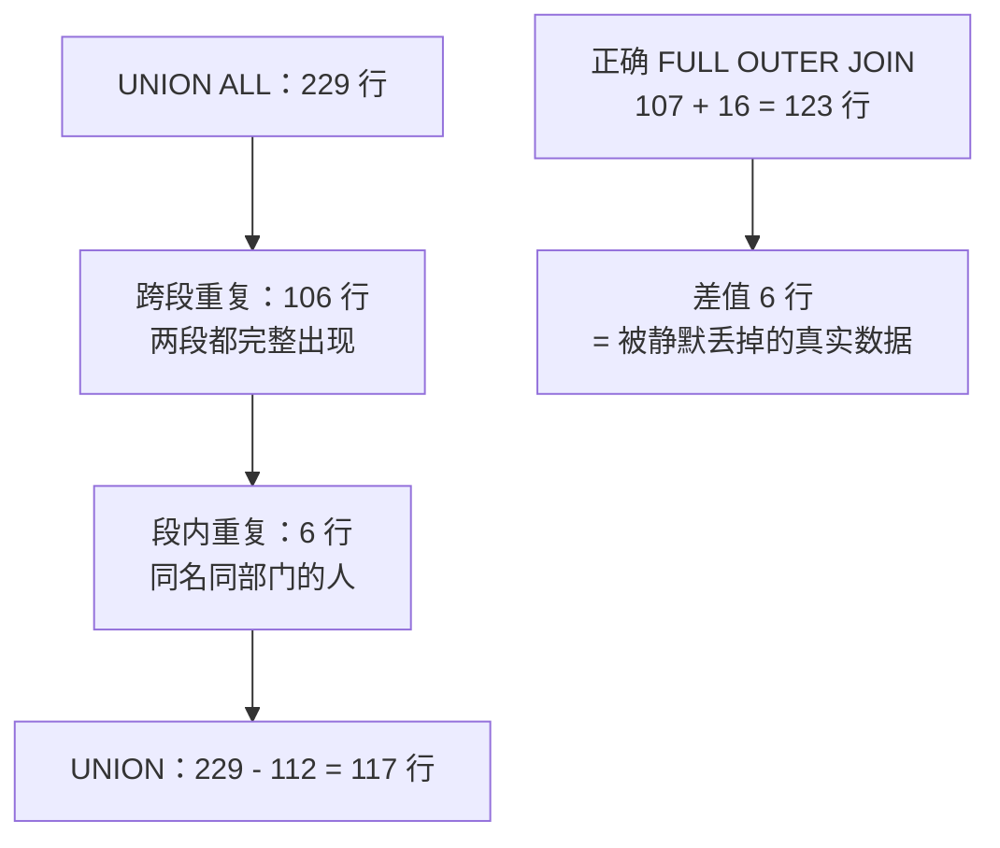

# 12. `UNION` 模拟全外连接时，为什么结果比预期少了 6 行？

> **记录时间**：2026-09-28
> **编号**：12
> **标签**：#UNION #FULLOUTERJOIN #集合去重 #静默丢数据

---

## 一、问题

用 `LEFT JOIN ... UNION ... RIGHT JOIN ...` 模拟 MySQL 不支持的 `FULL OUTER JOIN`，两段分别返回 107 行和 122 行，已知两边重复 106 行，按理去重后应该是 `1 + 106 + 16 = 123` 行，实际只有 **117** 行，少的 6 行去哪了？

**面试场景**：中高级后端二面，属于"代码 review 型"追问。面试官想看的是候选人是否意识到 **`UNION` 的去重是全局的**，以及能否意识到"投影后完全相同的两行真实数据会被静默合并"这个隐蔽 bug。这是区分"会写 SQL"和"能写对 SQL"的分水岭。

---

## 二、答案

### 一句话结论

`UNION` 做的是**全局去重**，不只消除两段之间的重复，也消除**某一段内部的自我重复**；那 106 行里本身就有 6 行内容重复，被一并合并了。

### 1. 是什么

`UNION` 与 `UNION ALL` 的唯一区别就是去重：

| 关键字 | 行为 | 代价 |
|---|---|---|
| `UNION` | 对合并结果做 `DISTINCT`，按**整行所有列**比较 | 需要临时表 + 排序/哈希，更慢 |
| `UNION ALL` | 直接拼接，不去重 | 快，无额外排序 |

关键认知：**去重是针对整个结果集的，不是"跨段去重"**。段内天生重复的行也会被压掉。

### 2. 为什么（底层原理）

实测数据（MySQL 9.3.0 / `atguigudb`）：

```
employees 107 行，departments 27 行
有部门的员工 106 行，无部门员工 1 行（Grant, employee_id=178）
有员工的部门 11 个，无员工的部门 16 个
```

各段行数：

| 部分 | 行数 | 构成 |
|---|---|---|
| `LEFT JOIN` | 107 | 106 行完整匹配 + 1 行 Grant（部门列 NULL） |
| `RIGHT JOIN` | 122 | 106 行完整匹配 + 16 行"无员工部门"（员工列 NULL） |
| `UNION ALL` | 229 | 107 + 122 |
| `UNION`（去重） | **117** | 比预期少 6 行 |

用户的推算 `1 + 106 + 16 = 123` 隐含了一个假设：**那 106 行彼此不同**。实测不成立：

```sql
SELECT COUNT(DISTINCT first_name, department_id)
FROM employees WHERE department_id IS NOT NULL;   -- 100，不是 106
```

原因是有 **6 组"同名 + 同部门"的员工**，他们投影出的三列一模一样：

| first_name | department_id | 人数 | employee_id |
|---|---|---|---|
| David | 80 | 2 | 151, 165 |
| James | 50 | 2 | 127, 131 |
| Julia | 50 | 2 | 125, 186 |
| Kevin | 50 | 2 | 124, 197 |
| Peter | 80 | 2 | 150, 152 |
| Randall | 50 | 2 | 143, 191 |



所以：

```
UNION 结果 = 106 行去重后的 100 行
           + LEFT  独有的 1 行（Grant）
           + RIGHT 独有的 16 行（无员工部门）
           = 117
```

**这不是行数误差，是丢数据**——David(151) 和 David(165) 是两个真实员工，`UNION` 把他们合并成了一行。

### 3. 怎么用

正确模拟 `FULL OUTER JOIN`（MySQL 至今不支持该语法）的写法：

```sql
SELECT e.first_name, e.department_id, d.department_name
FROM employees e LEFT JOIN departments d ON e.department_id = d.department_id

UNION ALL

SELECT e.first_name, e.department_id, d.department_name
FROM employees e RIGHT JOIN departments d ON e.department_id = d.department_id
WHERE e.employee_id IS NULL;      -- 只取 LEFT 补不出来的那 16 个空部门
```

实测返回 **123 行**，`107 + 16`，不多不少。

> **版本差异**：所有 MySQL 版本都不支持 `FULL OUTER JOIN` 语法，只能用上述方式模拟。MySQL 8.0.31 起支持 `INTERSECT` 和 `EXCEPT`，但依然没有 `FULL OUTER JOIN`。

### 4. 生产实践与坑

| 场景 | 建议 | 原因 |
|---|---|---|
| 模拟全外连接 | 必须用 `UNION ALL` + 排除条件 | 裸 `UNION` 会静默合并投影后相同的真实数据 |
| 合并结果集（如分库汇总、多条件拼接） | 默认用 `UNION ALL`，明确需要去重才用 `UNION` | `UNION` 的临时表 + 排序开销明显 |
| 需要去重时 | 确保 SELECT 列表包含**唯一标识列**（如主键 `employee_id`） | 有主键参与就不可能误合并 |
| 排查行数不符 | `SELECT COUNT(*)` 对比 `UNION` 与 `UNION ALL` 的行数差 | 差值就是被去重吃掉的行数，直接定位问题 |
| 结果集很大 | 警惕 `UNION` 的 `Using temporary` | 去重需要 `tmp_table_size` 内存，超了落盘变慢 |

### 5. 面试官可能追问

**追问 1**：`UNION` 和 `UNION ALL` 的性能差别在哪？

- 答法：`UNION` 需要额外一步去重——把结果写入临时表再做排序或哈希去重，`EXPLAIN` 里会出现 `Using temporary`；`UNION ALL` 只是流式拼接各行集，没有这一步。数据量越大差距越明显，所以**能用 `UNION ALL` 就不用 `UNION`**。

**追问 2**：`UNION` 去重是按主键还是按整行？

- 答法：按**整行所有列的组合**比较，与主键无关。只要两行在 SELECT 列表的每个列上都相等（含都为 NULL，`UNION` 把 NULL 视为相等），就会被合并。所以 SELECT 列表里漏掉主键是危险的。

**追问 3**：`UNION` 之后的 `ORDER BY` 该怎么用？

- 答法：`ORDER BY` 只能写在**最后一段之后**，作用于合并后的整个结果集，不能给某一段单独排序（单段排序必须包在派生表里）。同理 `LIMIT` 也只在最后生效。

---

## 三、举一反三

> 状态：待回答

**问题**：有一张订单表 `orders`，运营要求导出「2024 年下单的客户」和「2025 年下单的客户」的合并名单，SQL 如下：

```sql
SELECT c.customer_id, c.customer_name
FROM customers c JOIN orders o ON c.customer_id = o.customer_id
WHERE o.order_date >= '2024-01-01' AND o.order_date < '2025-01-01'
UNION
SELECT c.customer_id, c.customer_name
FROM customers c JOIN orders o ON c.customer_id = o.customer_id
WHERE o.order_date >= '2025-01-01' AND o.order_date < '2026-01-01';
```

一位客户（比如张三）在 2024 年下了 3 单、2025 年下了 5 单。

1. 这条 SQL 的结果里，张三会出现几次？中间发生了什么？
2. 把 `UNION` 改成 `UNION ALL` 后，张三会出现几次？为什么这个结果也不对？
3. 如何写出"每位客户恰好一行"的正确结果？写出至少两种写法并说明各自适用场景。

### 我的回答

（待填写）

### 评分与点评

（待评分）
</content>
