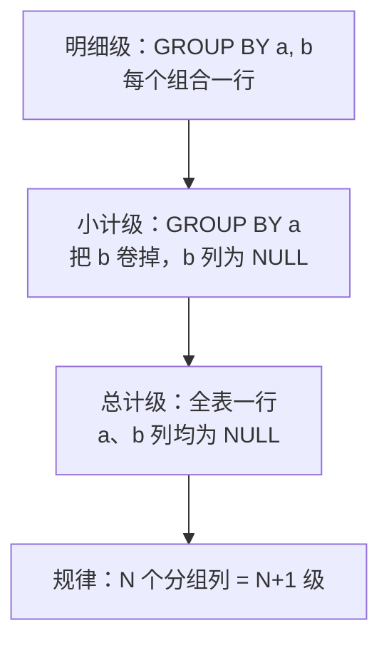

# 13. `WITH ROLLUP` 是干什么的？汇总行和真实 NULL 怎么区分？

> **记录时间**：2026-09-28
> **编号**：13
> **标签**：#GROUPBY #WITHROLLUP #GROUPING函数 #小计总计

---

## 一、问题

`GROUP BY ... WITH ROLLUP` 是做什么的？为什么加完之后结果多出来好几行 NULL？

**面试场景**：报表类岗位或后端岗的 SQL 进阶题。多数候选人只知道它能"加一行总计"，但说不出多列时的上卷层级、说不清汇总行 NULL 与真实 NULL 数据的区分方法，更不知道 `HAVING` 会连汇总行一起过滤。能答出 `GROUPING()` 的属于少数。

---

## 二、答案

### 一句话结论

`WITH ROLLUP` 是 `GROUP BY` 的扩展，在分组明细上**自动追加各级小计行和最后一行总计**，被"卷上去"的那一列显示为 NULL。

### 1. 是什么

```sql
SELECT department_id, COUNT(*) cnt, SUM(salary) total_salary
FROM employees
GROUP BY department_id WITH ROLLUP;
```

实测（`atguigudb`，MySQL 9.3.0）结果节选：

| department_id | cnt | total_salary |
|---|---|---|
| NULL | 1 | 7000.00 |
| 10 | 1 | 4400.00 |
| 50 | 45 | 156400.00 |
| 80 | 34 | 304500.00 |
| **NULL** | **107** | **691400.00** ← ROLLUP 追加的总计行 |

最后一行就是 ROLLUP 送的：全公司 107 人、工资总额 691400。

**多列时的上卷方向**：`GROUP BY a, b WITH ROLLUP` 产出 N+1 级，方向是**从右往左逐列合并**：



实测 `GROUP BY department_id, job_id WITH ROLLUP`：

| dept | job | cnt | total |
|---|---|---|---|
| 20 | MK_MAN | 1 | 13000.00 |
| 20 | MK_REP | 1 | 6000.00 |
| 20 | **NULL**（部门小计） | 2 | 19000.00 |
| 50 | SH_CLERK | 20 | 64300.00 |
| 50 | **NULL**（部门小计） | 45 | 156400.00 |
| **NULL** | **NULL**（全公司总计） | 107 | 691400.00 |

### 2. 为什么（底层原理）

ROLLUP 的本质是**对分组键做前缀式（prefix）聚合**：

- `ROLLUP(a, b, c)` 生成的分组集合是：`(a,b,c)`、`(a,b)`、`(a)`、`()`
- 注意它**不是**所有子集的组合——像 `(b)`、`(a,c)` 这类非前缀组合不会出现，那属于 `CUBE`

被合并掉（卷上去）的列在结果中填 NULL，因为它在该级别上"不参与分组"，值不唯一。

### 3. 怎么用

**`GROUPING()`：区分真实 NULL 与汇总行**（MySQL 8.0 起支持，实测 9.3.0 可用）：

```sql
SELECT department_id, COUNT(*) cnt, GROUPING(department_id) AS is_total
FROM employees GROUP BY department_id WITH ROLLUP;
```

返回 `1` 表示"这行是该列产生的汇总行"，`0` 表示真实数据行。实测前面所有行 `is_total=0`，最后总计行 `is_total=1`。

**生产模板**：

```sql
SELECT IF(GROUPING(department_id) = 1, '【全公司】', IFNULL(department_id, '未分配部门')) AS dept,
       IF(GROUPING(job_id)       = 1, '【全工种】', job_id)                             AS job,
       COUNT(*)    AS cnt,
       SUM(salary) AS total
FROM employees
GROUP BY department_id, job_id WITH ROLLUP;
```

实测输出：真实 NULL 显示成「未分配部门」，ROLLUP 汇总行显示成「全工种/全公司」，两者彻底分开。

> **版本差异**：MySQL 8.0.12 之前 `WITH ROLLUP` 与 `ORDER BY` 不能共存；8.0.12 起允许。MySQL 只支持 `WITH ROLLUP` 这一种写法，**不支持**标准 SQL 的 `GROUP BY ROLLUP(a, b)`，也**不支持 `CUBE`**。

### 4. 生产实践与坑

| 坑 | 现象 | 正确做法 |
|---|---|---|
| **NULL 混淆** | 真实 NULL 分组（如无部门员工）与汇总行都显示 NULL，用 `IFNULL` 美化会把真实数据错标成"总计" | 用 `GROUPING(col)` 判断，返回 1 才是汇总行 |
| **`ORDER BY` 打乱层级** | 8.0.12 起虽可共存，但排序会破坏"明细→小计→总计"的视觉层级，总计行可能被排到中间 | 外面套一层派生表，按 `GROUPING()` 排序把汇总行沉底 |
| **`HAVING` 过滤汇总行** | `HAVING` 在 ROLLUP 生成之后执行，会连小计/总计一起筛掉 | 条件里显式放行：`HAVING cnt > 5 OR GROUPING(department_id) = 1` |
| 想要所有维度组合 | ROLLUP 只出前缀组合，没有 `(b)`、`(b,c)` | 只能自己 `UNION ALL` 多段拼（MySQL 无 CUBE） |

实测证据：

```sql
-- HAVING 作用于 ROLLUP 行：总计行 cnt=107 被保留
SELECT department_id, COUNT(*) cnt, GROUPING(department_id) g
FROM employees GROUP BY department_id WITH ROLLUP HAVING cnt > 5;
-- 结果含一行：NULL | 107 | 1

-- 不做 IFNULL 替换时，两种 NULL 长得一模一样
SELECT department_id, COUNT(*) cnt, SUM(salary) total
FROM employees GROUP BY department_id WITH ROLLUP;
-- 第一行 NULL|1|7000（真实的 Grant）vs 最后一行 NULL|107|691400（汇总）
```

**整洁排序写法**：

```sql
SELECT * FROM (
  SELECT department_id, SUM(salary) total
  FROM employees GROUP BY department_id WITH ROLLUP
) t
ORDER BY GROUPING(t.department_id), t.total DESC;   -- 汇总行沉底
```

### 5. 面试官可能追问

**追问 1**：ROLLUP 产生的 NULL 和数据本身的 NULL 怎么区分？

- 答法：用 `GROUPING(col)`，返回 1 表示这行是该列的汇总行，0 表示真实数据。MySQL 8.0 起支持。不能靠 `IS NULL` 判断，因为两者都是 NULL。

**追问 2**：`ROLLUP` 和 `CUBE` 的区别？

- 答法：`ROLLUP(a,b,c)` 只生成前缀组合 `(a,b,c)`、`(a,b)`、`(a)`、`()`，共 N+1 级；`CUBE` 生成所有 2^N 种维度组合，包括 `(b)`、`(c)`、`(a,c)` 等非前缀组合。MySQL 不支持 `CUBE`，需要的话只能 `UNION ALL` 多段拼。

**追问 3**：ROLLUP 的结果能排序吗？

- 答法：MySQL 8.0.12 起 `WITH ROLLUP` 可以和 `ORDER BY` 共存，但排序会把总计行排到任意位置、破坏层级结构。想保持"明细→小计→总计"的报表观感，应包一层派生表并按 `GROUPING()` 排序，把汇总行强制沉底。

---

## 三、举一反三

> 状态：待回答

**问题**：某电商报表需要按「省份 → 城市 → 门店」三级统计销售额，并且要求每一级都出小计，最后出全国总计。已知 `stores` 表有 `province`、`city`、`store_id`、`store_name` 字段，`orders` 表有 `store_id`、`amount` 字段，其中部分门店的 `city` 字段本身是 NULL（数据缺失），部分门店当期没有订单。

1. 用一条 `WITH ROLLUP` 语句写出这个报表，要求「数据缺失的城市」和「各级小计行」在展示上必须能被肉眼区分开，写出完整 SQL。
2. 这个查询一共会产生几种"NULL 形态"的行？分别是什么含义？
3. 如果再要求"只保留销售额大于 100 万的行"，同时又必须保留所有小计与总计行，`HAVING` 该怎么写？为什么直接写 `HAVING SUM(amount) > 1000000` 会把报表搞坏？

### 我的回答

（待填写）

### 评分与点评

（待评分）
</content>
