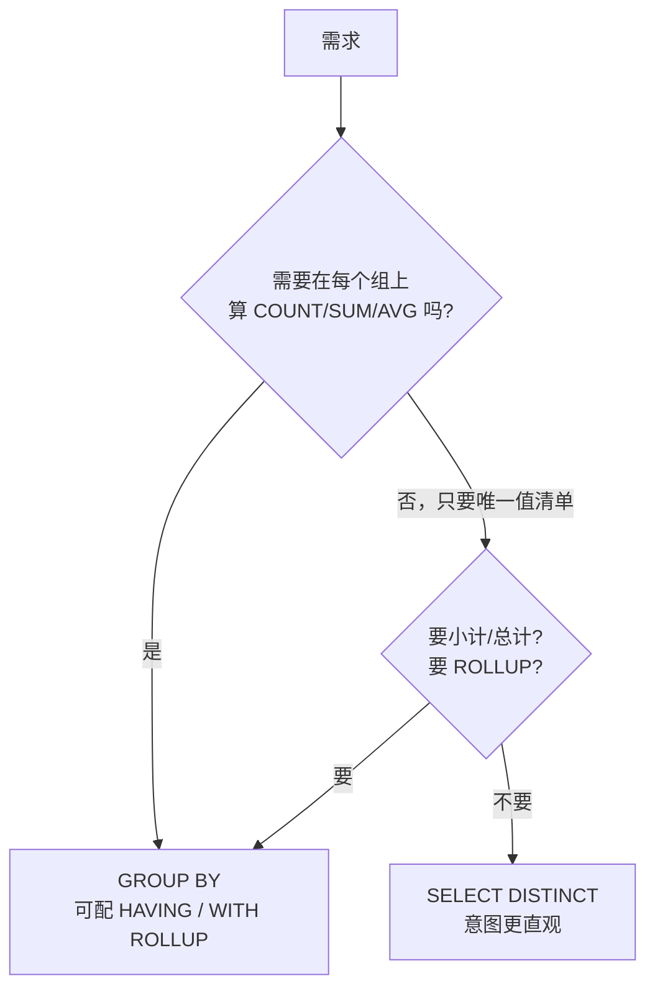

# 14. `SELECT DISTINCT` 和 `GROUP BY` 去重，到底有什么区别？

> **记录时间**：2026-09-28
> **编号**：14
> **标签**：#去重 #分组 #松散索引扫描 #执行计划 #ONLY_FULL_GROUP_BY

---

## 一、问题

```sql
SELECT DISTINCT e.department_id FROM employees e;
SELECT e.department_id FROM employees e GROUP BY e.department_id;
```

两条语句结果完全相同，那去重和分组的区别到底在哪里？

**面试场景**：一面基础题，属于"看似简单但能挖很深"的类型。初级候选人会说"GROUP BY 能带聚合函数"就结束了；高分答案要讲到**优化器把两者编译成同一条执行路径**（`Using index for group-by`）、**松散索引扫描**，以及 `ONLY_FULL_GROUP_BY` 下两者对 SELECT 列表的约束差异。

---

## 二、答案

### 一句话结论

**在"只要唯一值清单"这个场景下，MySQL 把两者当成同一件事执行，性能零差别**；区别在语义定位与能力边界：DISTINCT 是投影去重，GROUP BY 是分组聚合框架。

### 1. 是什么

| 维度 | `SELECT DISTINCT` | `GROUP BY` |
|---|---|---|
| 定位 | **投影后去重**，作用在 SELECT 列表的**整行组合**上 | **分组框架**，把行划成组，每组压成一行 |
| 去重键 | 永远等于 SELECT 列表的全部列 | 由你显式指定，可与 SELECT 列表不同 |
| 能否带聚合函数 | ❌ | ✅ 天生为聚合设计 |
| 能否用 `HAVING` | ❌ | ✅ |
| 能否用 `WITH ROLLUP` | ❌ | ✅ |

### 2. 为什么（底层原理）

实测（`atguigudb`，MySQL 9.3.0，`department_id` 上有索引 `emp_dept_fk`）：

```sql
EXPLAIN SELECT DISTINCT e.department_id FROM employees e\G
EXPLAIN SELECT e.department_id FROM employees e GROUP BY e.department_id\G
```

两个执行计划**一字不差**：

| | DISTINCT | GROUP BY |
|---|---|---|
| type | range | range |
| key | emp_dept_fk | emp_dept_fk |
| rows | 13 | 13 |
| **Extra** | **Using index for group-by** | **Using index for group-by** |

注意这个讽刺的细节：**连 `DISTINCT` 的执行计划写的都是 `Using index for group-by`** —— 优化器直接把去重改写成分组来执行。它走的是**松散索引扫描（Loose Index Scan）**：沿着索引"跳着读"，每个不同值只读一次，既不扫全表也不建临时表。

换成无索引的列（`first_name`）再测，两者依然相同：

| | DISTINCT | GROUP BY |
|---|---|---|
| type | ALL | ALL |
| Extra | Using temporary | Using temporary |

结论：**这个场景下比性能没有意义，选哪个是表达意图的问题。**

### 3. 怎么用

实测能力边界（MySQL 默认开启 `ONLY_FULL_GROUP_BY`）：

```sql
-- ① DISTINCT 带聚合函数：报错
SELECT DISTINCT department_id, COUNT(*) FROM employees;
-- ERROR 1140: In aggregated query without GROUP BY ... incompatible with only_full_group_by

-- ② GROUP BY 时 SELECT 非分组列：报错
SELECT department_id, salary FROM employees GROUP BY department_id;
-- ERROR 1055: ... not functionally dependent on columns in GROUP BY clause

-- ③ GROUP BY + 聚合：正常工作，这才是它的主场
SELECT department_id, COUNT(*) cnt, SUM(salary) total
FROM employees GROUP BY department_id;
```

多列陷阱：

```sql
SELECT DISTINCT department_id, job_id FROM employees;                  -- ✅ 对 (部门,工种) 组合去重
SELECT department_id, job_id FROM employees GROUP BY department_id;    -- ❌ 1055 报错
```

`DISTINCT` 后面所有列共同构成去重键；`GROUP BY` 的分组键由你指定，两者可以不同——**这是二者最实质的语法差异**。



> **版本差异**：MySQL 5.7 及之前 `GROUP BY` 带隐式排序（等价自带 `ORDER BY`）；**8.0 起该隐式排序被移除**，两条语句返回顺序都不保证。要稳定结果必须显式 `ORDER BY`。

### 4. 生产实践与坑

| 场景 | 建议 | 原因 |
|---|---|---|
| 只要枚举值列表（如部门列表、状态码列表） | `SELECT DISTINCT` | 意图直观，可读性最好 |
| 需要统计每组数量/金额 | `GROUP BY` + 聚合 | `DISTINCT` 做不到 |
| 大表去重 | 保证该列有索引 | 有索引走 Loose Index Scan，无索引要 `Using temporary` |
| 需要稳定顺序 | 显式写 `ORDER BY` | 8.0 起 `GROUP BY` 不再隐式排序 |
| `COUNT(DISTINCT col)` | 认清它是聚合函数内部的去重 | 与结果集去重无关，代价高且难并行，别与 `SELECT DISTINCT` 混淆 |
| 想对部分列去重却返回更多列 | `DISTINCT` 做不到，需要 `GROUP BY` + 聚合或窗口函数 | `DISTINCT` 的去重键恒等于 SELECT 列表 |

### 5. 面试官可能追问

**追问 1**：两者性能有差别吗？

- 答法：在只取唯一值的场景下没有差别，MySQL 把 `DISTINCT` 编译成分组执行，`EXPLAIN` 里连 `DISTINCT` 都显示 `Using index for group-by`；有索引时走松散索引扫描，没有索引时两者都是 `Using temporary`。真正的差异只在语义与能力：`GROUP BY` 能带聚合、`HAVING`、`WITH ROLLUP`，`DISTINCT` 都不行。

**追问 2**：`GROUP BY` 的结果顺序有保证吗？

- 答法：MySQL 5.7 及之前 `GROUP BY` 带隐式排序，8.0 起移除，现在顺序完全不保证。看到的顺序只是索引扫描的巧合，要稳定结果必须显式 `ORDER BY`。

**追问 3**：`SELECT DISTINCT a, b` 与 `GROUP BY a, b` 等价吗？只写 `GROUP BY a` 行不行？

- 答法：`SELECT DISTINCT a, b` 与 `GROUP BY a, b` 在结果集上等价（都是对组合去重）；但 `GROUP BY a` 时 SELECT `b` 在 `ONLY_FULL_GROUP_BY` 下直接报 1055，除非 `a` 是主键从而产生函数依赖。所以不能随意少写分组列。

---

## 三、举一反三

> 状态：待回答

**问题**：有一张 5000 万行的订单表 `orders`，字段 `user_id`、`shop_id`、`status`、`created_at`，其中 `user_id` 上有普通二级索引。现在要统计"下过单的去重用户数"，有四种写法：

```sql
-- A
SELECT COUNT(DISTINCT user_id) FROM orders;
-- B
SELECT COUNT(*) FROM (SELECT DISTINCT user_id FROM orders) t;
-- C
SELECT COUNT(*) FROM (SELECT user_id FROM orders GROUP BY user_id) t;
-- D
SELECT COUNT(*) FROM (SELECT 1 FROM orders GROUP BY user_id) t;
```

1. 四种写法结果是否相同？在 `user_id` 允许为 NULL 时，A 与 B/C/D 的结果会有什么差别？为什么？
2. 从执行计划角度看，B 和 C 会不会真的物化出 5000 万行再去重？MySQL 会做什么优化？
3. 如果这个查询要跑 3 秒，业务方要求降到 300ms 以内，你会给出哪几种方案？各有什么代价？

### 我的回答

（待填写）

### 评分与点评

（待评分）
</content>
