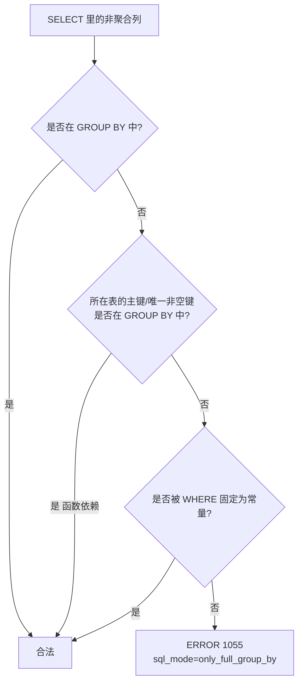

# 15. `ONLY_FULL_GROUP_BY` 开着，为什么 SELECT 里的非分组列还能执行成功？

> **记录时间**：2026-09-28
> **编号**：15
> **标签**：#ONLY_FULL_GROUP_BY #函数依赖 #sql_mode #1055

---

## 一、问题

```sql
SELECT d.department_name, d.location_id, COUNT(e.employee_id),
       TRUNCATE(IFNULL(AVG(e.salary),0),2) AS department_avg_salary
FROM departments d
LEFT JOIN employees e ON d.department_id = e.department_id
GROUP BY d.department_id            -- 只按 department_id 分组
ORDER BY department_avg_salary DESC;
```

不是说 SELECT 中的非聚合字段只能是 GROUP BY 中的字段吗？`department_name` 和 `location_id` 都不在 GROUP BY 里，为什么能执行成功？

**面试场景**：中高级岗的经典"打脸题"。背题的候选人会答"SELECT 只能写 GROUP BY 的列"，一旦看到这种能跑通的反例就卡住。面试官真正想考的是**函数依赖（functional dependency）**这条 SQL 标准规则，以及跨表连接时哪一侧的列才能享受这条豁免。

---

## 二、答案

### 一句话结论

`ONLY_FULL_GROUP_BY` 检查的不是"列在不在 GROUP BY 里"，而是**"该列的值在组内是否唯一确定"**——即是否**函数依赖**于分组列。`d.department_id` 是 `departments` 的主键，同表其余列都被它唯一锁定，所以合法。

### 1. 是什么

SQL:1999 标准定义了函数依赖检测，MySQL 从 5.7.5 起实现。规则原文可概括为：

> 若 GROUP BY 的列是某表的 `PRIMARY KEY` 或 `UNIQUE NOT NULL` 列，则该表其余列在功能上依赖于它，可以出现在 SELECT 列表中。

原因很直白：给定主键 `department_id`，`department_name` 和 `location_id` **有且只有一个值**，分组后组内不可能出现多个不同值，"选哪个"没有歧义，因此放行。

实测环境：

```
@@sql_mode: ONLY_FULL_GROUP_BY,STRICT_TRANS_TABLES,...
departments: PRIMARY KEY (`department_id`), UNIQUE KEY `dept_id_pk` (`department_id`)
```

### 2. 为什么（底层原理）

MySQL 的函数依赖检测是**按表判定**的，且**不做跨表等价推导**。这带来三个必须记住的边界：

| 写法 | 结果 | 原因 |
|---|---|---|
| `GROUP BY d.department_id` + SELECT `d.department_name, d.location_id` | ✅ 通过 | 分组列是 departments 主键 |
| `GROUP BY d.location_id` + SELECT `d.department_name` | ❌ **1055** | `location_id` 非唯一，一个地点对应多个部门 |
| `GROUP BY e.department_id` + SELECT `d.department_name` | ❌ **1055** | 分组列属于 **employees** 表，MySQL 不做跨表等价传递 |
| `WHERE d.department_id = 10` + `GROUP BY d.department_name` + SELECT `d.location_id` | ✅ 通过 | `location_id` 被 WHERE 钉死为单一值 |

第三个反例最值得记住：

```sql
-- ❌ 报错：分组键是 employees 侧的外键列
SELECT d.department_name, d.location_id, COUNT(e.employee_id)
FROM departments d LEFT JOIN employees e ON d.department_id = e.department_id
GROUP BY e.department_id;
-- ERROR 1055: 'atguigudb.d.department_name' which is not functionally dependent
```

`e.department_id` 与 `d.department_id` 在值上明明相等，但 MySQL 只认"这个分组列在**它所属的表**里是不是主键/唯一非空键"，不会顺着 `ON` 条件做等价传递。**结论：`GROUP BY` 要写主表那一侧的列。**



**三条放行规则**：

1. **主键/唯一非空键依赖**：分组列是某表主键或 `UNIQUE NOT NULL` 列 → 该表其余列可自由 SELECT。
2. **WHERE / ON 中的常量等值**：某列被 `WHERE col = 常量` 钉死为单一值 → 该列可 SELECT（去掉 WHERE 立刻报 1055，实测已验证）。
3. **聚合函数内的列不受限**：`COUNT(e.employee_id)`、`AVG(e.salary)` 里的列永远合法。

### 3. 怎么用

**利用函数依赖写得更简洁**（也是本题的正确写法）：

```sql
SELECT d.department_name,
       d.location_id,
       COUNT(e.employee_id)                     AS emp_cnt,
       TRUNCATE(IFNULL(AVG(e.salary), 0), 2)    AS avg_salary
FROM departments d
LEFT JOIN employees e ON d.department_id = e.department_id
GROUP BY d.department_id        -- 主键分组，同表其余列自动放行
ORDER BY avg_salary DESC;
```

实测输出前几行：

| department_name | location_id | emp_cnt | avg_salary |
|---|---|---|---|
| Executive | 1700 | 3 | 19333.33 |
| Accounting | 1700 | 2 | 10150 |
| Public Relations | 2700 | 1 | 10000 |
| Marketing | 1800 | 2 | 9500 |

啰嗦但同样合法的写法：

```sql
GROUP BY d.department_id, d.department_name, d.location_id
```

> **版本差异**：`ONLY_FULL_GROUP_BY` 从 MySQL 5.7.5 起成为默认 `sql_mode` 之一，5.6 及之前默认关闭（那时任意列都能 SELECT，返回值不确定，是著名的坑）。

### 4. 生产实践与坑

| 场景 | 建议 | 原因 |
|---|---|---|
| 关联查询分组 | GROUP BY 主表侧的主键列 | 写外键侧会触发 1055 |
| 宽表分组 | 只按主键分组，不要把所有展示列塞进 GROUP BY | 分组列越多，排序/临时表代价越大；且展示列若哪天不再唯一，分组粒度会被意外改变 |
| 从 MySQL 5.6 升级 | 提前用 `SELECT @@sql_mode` 检查并修复存量 SQL | 5.7 默认开启后大量老 SQL 会报 1055 |
| 想临时绕过 | 不建议改 `sql_mode` 关掉约束 | 关闭后非聚合列返回值**不确定**，是线上数据错误的经典来源 |
| 视图/ORM 生成的 SQL | 确认分组列是主键或唯一键 | 否则上线即报 1055 |

### 5. 面试官可能追问

**追问 1**：`ONLY_FULL_GROUP_BY` 到底限制的是什么？

- 答法：它要求 SELECT 列表中的非聚合列必须**函数依赖于 GROUP BY 列**，即组内取值唯一确定。最常见的豁免是按主键或唯一非空键分组——此时同表其余列都被唯一锁定。它并不是机械地要求"列必须出现在 GROUP BY 里"。

**追问 2**：为什么 `GROUP BY e.department_id` 时 SELECT `d.department_name` 会报错？

- 答法：MySQL 的函数依赖检测按表判定且不做跨表等价传递。`e.department_id` 虽然在值上等于 `d.department_id`，但它在 `employees` 表里只是外键，不是主键/唯一键，`departments` 表的列无法因此获得依赖豁免。改成 `GROUP BY d.department_id` 即可。

**追问 3**：关掉 `ONLY_FULL_GROUP_BY` 会有什么后果？

- 答法：非分组列的返回值变成**未定义行为**——MySQL 会从组内任意一行取值，不同版本、不同执行计划下结果可能不同，是静默的数据错误。这条约束存在的意义就是把这种不确定性在语法层面拦住，生产环境不应关闭。

---

## 三、举一反三

> 状态：待回答

**问题**：有订单表 `orders`（主键 `order_id`，字段 `user_id`、`amount`、`created_at`）和用户表 `users`（主键 `user_id`，字段 `user_name`、`city`）。以下四条 SQL 在 `ONLY_FULL_GROUP_BY` 开启时，哪些能执行成功、哪些会报 1055？请逐条判断并说明依据：

```sql
-- A
SELECT u.user_name, SUM(o.amount) FROM orders o JOIN users u ON o.user_id = u.user_id GROUP BY u.user_id;
-- B
SELECT o.user_id, u.user_name, COUNT(*) FROM orders o JOIN users u ON o.user_id = u.user_id GROUP BY o.user_id;
-- C
SELECT u.city, COUNT(*) FROM orders o JOIN users u ON o.user_id = u.user_id WHERE u.user_id = 100 GROUP BY o.order_id;
-- D
SELECT o.order_id, o.user_id, SUM(o.amount) FROM orders o GROUP BY o.order_id;
```

对能执行成功的那些，进一步说明：**分组粒度到底是什么**（一行代表一个订单、一个用户、还是别的）？如果把 D 改成 `GROUP BY o.order_id, o.user_id`，分组粒度会变吗？为什么？

### 我的回答

（待填写）

### 评分与点评

（待评分）
</content>
