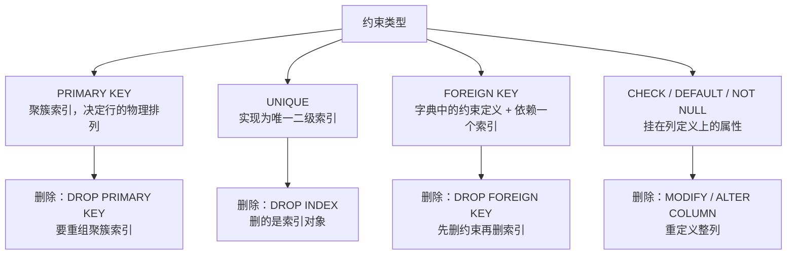

# 16. 约束的增删改查怎么写？业务上什么时候才需要改约束？

> **记录时间**：2026-09-29
> **编号**：16
> **标签**：#约束 #CONSTRAINT #ALTERTABLE #OnlineDDL #迁移脚本

---

## 一、问题

1. 创建、修改、删除列约束和表约束都有哪些语法？列级约束和表级约束有什么区别？
2. 一般业务中应该不存在要删除或修改约束的情况吧？都是在建表的时候处理好？

**面试场景**：一面到二面的 DDL 基础题，属于"会写不难、写对很难"的类型。面试官真正想看的是两点：一是能否说清 MySQL 删除约束**没有通用语法**（`DROP CONSTRAINT` 对主键无效，必须分类型写）；二是能否意识到约束变更是**高危 DDL**，需要走迁移脚本并评估 Online DDL 代价。第二个问题尤其能区分"写过 demo"和"上过生产"。

---

## 二、答案

### 一句话结论

**约束应在建表时一次设计清楚；变更语法必须会，因为演进期一定会用到——加约束（尤其唯一键）远比删约束常见。**

### 1. 是什么

约束（constraint）是定义在列或表上的**数据完整性规则**，属于 DDL 范畴。按书写位置分为两级：

| 约束 | 列级 | 表级 | 说明 |
|---|---|---|---|
| `NOT NULL` | ✅ | ❌ | 只能跟在列定义后 |
| `DEFAULT` | ✅ | ❌ | 只能列级 |
| `AUTO_INCREMENT` | ✅ | ❌ | 只能列级，且该列必须是键 |
| `PRIMARY KEY` | ✅ | ✅ | 单列可列级，**复合主键必须表级** |
| `UNIQUE` | ✅ | ✅ | 复合唯一必须表级 |
| `CHECK` | ✅ | ✅ | MySQL 8.0.16 起才真正生效 |
| `FOREIGN KEY` | ❌ | ✅ | **MySQL 不支持列级外键** |

**坑**：MySQL 会解析列级的 `REFERENCES` 子句但**静默忽略它**（"MySQL does not recognize or support inline REFERENCES specifications"）。写在列后面不报错、也不生效，所以外键**必须**写成表级约束。

### 2. 为什么（底层原理）

MySQL 中不同约束的**实现机制完全不同**，这直接决定了它们为什么不能用同一套语法删除：



关键推论：

- **`UNIQUE` 在 MySQL 里就是索引**（唯一索引），所以删它用 `DROP INDEX`。
- **外键依赖一个索引**：如果该索引是外键自动创建或被唯一约束占用，直接 `DROP INDEX` 会报 `ERROR 1553: Cannot drop index ... needed in a foreign key constraint`，必须先 `DROP FOREIGN KEY`（实测已复现）。
- **`NOT NULL` / `DEFAULT` 是列属性**，没有独立的删除语法，只能用 `MODIFY COLUMN` / `ALTER COLUMN` 重定义整列，代价是**重建表**。
- **`DROP CONSTRAINT` 是 MySQL 8.0.16 才引入的通用写法**，可用于 UNIQUE / FOREIGN KEY / CHECK，但**对主键无效**（实测 `DROP CONSTRAINT PRIMARY KEY` 直接报语法错误 1064）。

### 3. 怎么用

**（1）创建：建表时定义**

```sql
CREATE TABLE child (
  -- 列级约束
  id     INT         NOT NULL AUTO_INCREMENT PRIMARY KEY,
  code   VARCHAR(20) NOT NULL UNIQUE,
  age    INT         DEFAULT 0 CHECK (age >= 0),
  status TINYINT     NOT NULL DEFAULT 1,

  -- 表级约束
  CONSTRAINT pk_child  PRIMARY KEY (id, code),        -- 复合主键只能表级
  CONSTRAINT uq_pair   UNIQUE (code, status),
  CONSTRAINT chk_range CHECK (age BETWEEN 0 AND 150),
  CONSTRAINT fk_parent FOREIGN KEY (pid)
        REFERENCES parent(id)
        ON DELETE CASCADE
        ON UPDATE CASCADE
);
```

外键级联选项：`RESTRICT` / `NO ACTION`（默认，阻止）、`CASCADE`（跟着删改）、`SET NULL`（置空，该列须允许 NULL）。

不写 `CONSTRAINT 名字` 时系统自动命名：主键固定为 `PRIMARY`，唯一键默认用列名，外键为 `表名_ibfk_N`。

**（2）追加：ALTER TABLE ADD**

```sql
ALTER TABLE child ADD PRIMARY KEY (id);
ALTER TABLE child ADD CONSTRAINT uq_code UNIQUE (code);
ALTER TABLE child ADD CONSTRAINT chk_age CHECK (age >= 0);
ALTER TABLE child ADD CONSTRAINT fk_pid FOREIGN KEY (pid)
      REFERENCES parent(id) ON DELETE CASCADE;
ALTER TABLE child MODIFY COLUMN name VARCHAR(50) NOT NULL;   -- 加 NOT NULL
ALTER TABLE child ALTER COLUMN age SET DEFAULT 18;           -- 加/改默认值
```

实测通过：`ADD CONSTRAINT uq_b UNIQUE (b)`、`ADD CONSTRAINT chk_a CHECK (a > 0)`。

**（3）删除：按类型分家（全部实测，MySQL 9.3.0）**

| 要删的约束 | 正确语法 | 实测 |
|---|---|---|
| 主键 | `ALTER TABLE t DROP PRIMARY KEY;` | ✅ |
| 唯一键 | `DROP INDEX uq_name;` 或 `DROP CONSTRAINT uq_name;` | ✅ 均可（后者底层等价 DROP INDEX） |
| 外键 | `DROP FOREIGN KEY fk_name;` 或 `DROP CONSTRAINT fk_name;` | ✅ 均可 |
| CHECK | `DROP CHECK chk_name;` 或 `DROP CONSTRAINT chk_name;` | ✅ 均可 |
| 默认值 | `ALTER TABLE t ALTER COLUMN col DROP DEFAULT;` | ✅ |
| NOT NULL | `ALTER TABLE t MODIFY COLUMN col INT NULL;` | ✅ |
| AUTO_INCREMENT | `ALTER TABLE t MODIFY COLUMN id INT NOT NULL;` | 用 MODIFY 重定义去掉 |

实测踩到的两个错：

```sql
ALTER TABLE t DROP CONSTRAINT PRIMARY KEY;
-- ERROR 1064: syntax error near 'PRIMARY KEY'          ← 主键不能这么删

ALTER TABLE t DROP CONSTRAINT uq_pid;
-- ERROR 1553: Cannot drop index 'uq_pid': needed in a foreign key constraint
-- ← 唯一索引正被外键占用，必须先删外键
```

**（4）查看**

```sql
SHOW CREATE TABLE child\G                     -- 最常用

SELECT CONSTRAINT_NAME, CONSTRAINT_TYPE       -- 可筛选、可批量审计
FROM information_schema.TABLE_CONSTRAINTS
WHERE TABLE_SCHEMA = 'atguigudb' AND TABLE_NAME = 'child';

SELECT CONSTRAINT_NAME, COLUMN_NAME, REFERENCED_TABLE_NAME, REFERENCED_COLUMN_NAME
FROM information_schema.KEY_COLUMN_USAGE
WHERE TABLE_SCHEMA = 'atguigudb' AND TABLE_NAME = 'child';
```

实测输出：

```
CONSTRAINT_NAME   CONSTRAINT_TYPE
PRIMARY           PRIMARY KEY
uq_pid            UNIQUE
fk_pid            FOREIGN KEY
chk_age           CHECK
```

> **版本差异**：`CHECK` 在 8.0.16 之前可以写但**不生效**；`DROP CONSTRAINT` 语法 8.0.16 才引入；`ALTER TABLE ... ALGORITHM=INSTANT` 加列是 8.0.29 起的能力。

### 4. 生产实践与坑

**（1）约束变更的真实代价**（这是"建表时设计好"的根本原因）

| 操作 | MySQL 8.0 的代价 |
|---|---|
| `ADD PRIMARY KEY` | **重建整表**（聚簇索引重组），最贵 |
| `ADD UNIQUE` / `ADD INDEX` | Online DDL，不重建表，但仍需 MDL 锁 |
| `MODIFY COLUMN`（改类型、加 `NOT NULL`） | **重建整表** |
| `DROP` 各类约束 | 相对便宜，但要重拿 MDL 锁 |

大表上重建表意味着磁盘 IO 打满、主从延迟、MDL 锁排队可能引发雪崩。

**（2）加唯一键的标准流程（最高频的约束变更）**

直接 `ADD UNIQUE` 大概率因存量脏数据失败：

```sql
-- 第一步：必须先查重
SELECT phone, COUNT(*) cnt FROM user GROUP BY phone HAVING cnt > 1;

-- 第二步：确认无重复后再加，显式指定算法与锁级别
ALTER TABLE user
  ADD CONSTRAINT uq_phone UNIQUE (phone),
  ALGORITHM = INPLACE, LOCK = NONE;
```

跳过查重会报 `ERROR 1062: Duplicate entry`，大表上跑到一半才失败，白等几十分钟。

**（3）业务上什么时候真的需要改约束**

| 场景 | 例子 | 操作 |
|---|---|---|
| 业务规则收紧 | 手机号从允许重复改为唯一 | `ADD UNIQUE` |
| 去物理外键 | 老系统改用逻辑外键 | `DROP FOREIGN KEY` |
| 主键撞墙 | `INT` 自增到 21 亿上限 | 改 `BIGINT`，**重建整表** |
| 默认值调整 | 状态枚举 `DEFAULT 0` 改 `1` | `ALTER COLUMN ... SET DEFAULT` |
| 约束写错 | `CHECK (age > 0)` 写成 `>= 0` | `DROP CHECK` 后重加 |
| 过度约束反噬 | 早期 `NOT NULL` 现在允许为空 | `MODIFY COLUMN ... NULL` |

**核心不对称性**：加约束（尤其唯一键）远比删约束常见。需求演进通常是"以前没限制，现在要限制"。

**（4）变更必须走迁移工具，不要手工 ALTER**

```
Flyway / Liquibase / TypeORM migration / Prisma migrate
```

DDL 也是代码，需要评审、需要可回滚、需要在 dev → test → prod 保持一致。手工在客户端工具里点一下，环境迟早不一致。

向后兼容的发布原则（扩展-收缩三步法）：

```
V5__add_nickname.sql       ← 加新列，新旧代码都能跑
（发布新代码：同时写两个字段）
V6__backfill.sql           ← 数据回填
（发布新代码：只读新列）
V7__drop_name.sql          ← 下一版才删旧列
```

直接在一个版本里重命名列 = 老版本应用立刻全线报错。

**（5）约束设计的最佳实践清单**

| 项 | 建议 |
|---|---|
| 主键 | **每张 InnoDB 表都显式定义主键**，没有的话 InnoDB 会自建 6 字节隐藏主键 |
| 主键类型 | 一律 `BIGINT UNSIGNED AUTO_INCREMENT`，别用 INT |
| 外键 | 互联网业务库用**逻辑外键**（应用层保证），物理外键仅小系统/管理后台使用 |
| 非空 | 所有业务必填字段加 `NOT NULL`，含状态字段 |
| 唯一 | 业务唯一性尽早加 `UNIQUE`，让数据库兜底而不是靠应用层判断 |
| CHECK | 能用声明式约束表达的校验，不要用触发器写；注意 8.0.16 版本边界 |
| 默认值 | 配合 `NOT NULL` 使用，避免 NULL 语义歧义 |

### 5. 面试官可能追问

**追问 1**：MySQL 里怎么删除一个约束？有通用的 `DROP CONSTRAINT` 吗？

- 答法：没有完全通用的写法。`DROP CONSTRAINT` 是 8.0.16 引入的，可用于 UNIQUE、FOREIGN KEY、CHECK，但**对主键无效**，主键必须 `DROP PRIMARY KEY`。UNIQUE 本质是唯一索引，习惯上用 `DROP INDEX`；`NOT NULL` 和 `DEFAULT` 没有独立删除语法，必须 `MODIFY COLUMN` / `ALTER COLUMN` 重定义列。

**追问 2**：线上大表要加一个唯一索引，怎么做？

- 答法：先 `GROUP BY ... HAVING COUNT(*) > 1` 查重并清洗存量数据；再用 `ALTER TABLE ... ALGORITHM=INPLACE, LOCK=NONE` 加（8.0 支持不重建表）；执行前确认没有长事务持有 MDL 锁（`information_schema.innodb_trx`），否则 DDL 排队会阻塞后续所有查询；超大表则走 `gh-ost` / `pt-online-schema-change`。

**追问 3**：约束应该建表时写好，还是后期 ALTER？

- 答法：**90% 应在设计阶段定好**，因为约束变更是 DDL，大表上 `ADD PRIMARY KEY` 和 `MODIFY COLUMN` 都要重建整表，代价极高。但演进期一定有 10% 的场景需要改（业务规则收紧、去外键、主键撞墙、约束写错、过度约束反噬），所以语法必须会，而且变更要走版本化迁移工具、保证向后兼容，不能手工执行。

---

## 三、举一反三

> 状态：待回答

**问题**：线上有一张 8000 万行的 `user` 表（`id BIGINT` 主键，`phone VARCHAR(20)` 已有普通索引但可重复，`status TINYINT NOT NULL DEFAULT 1`，没有外键）。现在业务要求「手机号必须全局唯一」，同时要求「把 `status` 的默认值从 1 改成 0」。

1. 请写出完整的操作步骤（含前置检查、执行顺序、每步的代价），并说明为什么这两件事的代价完全不同。
2. 如果查重发现确实有 3 万条重复手机号，直接加唯一索引会发生什么？在不允许删除任何用户数据的前提下，你有哪些处理路径？
3. 这两个变更要放进 Flyway/TypeORM 迁移脚本里吗？如果放，需要注意什么？如果其中一个必须"手工执行"，理由是什么？

### 我的回答

（待填写）

### 评分与点评

（待评分）
</content>
